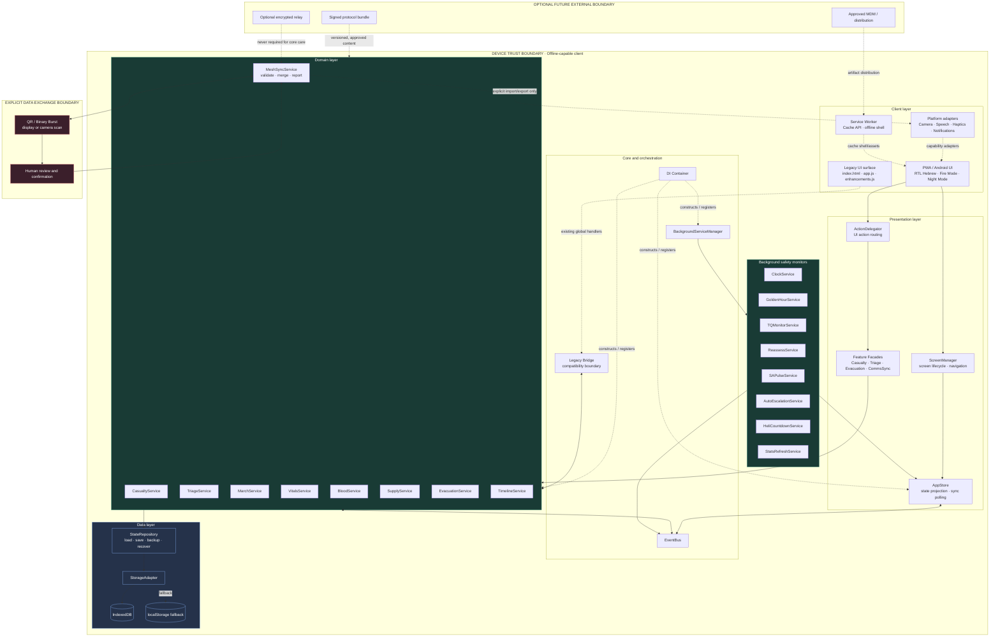
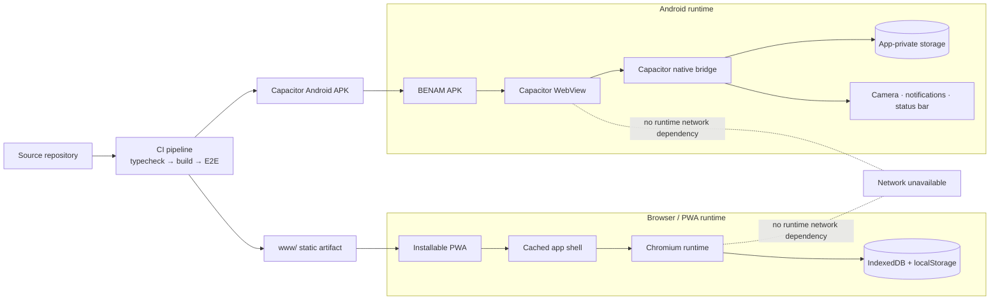
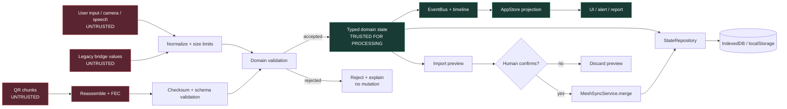
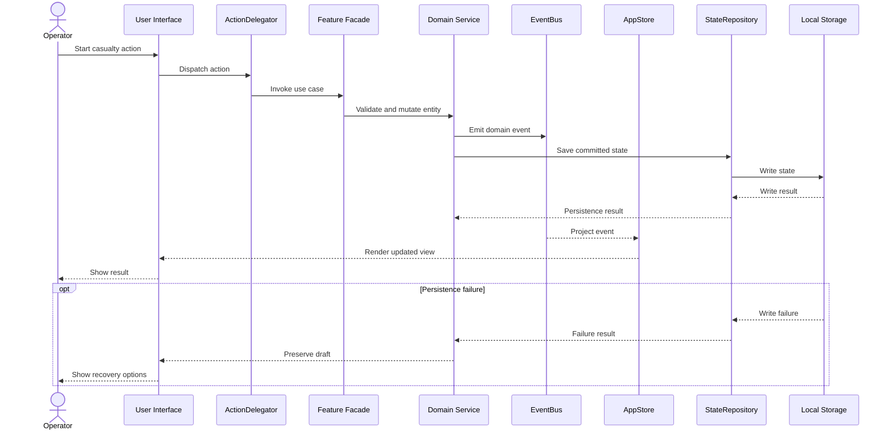
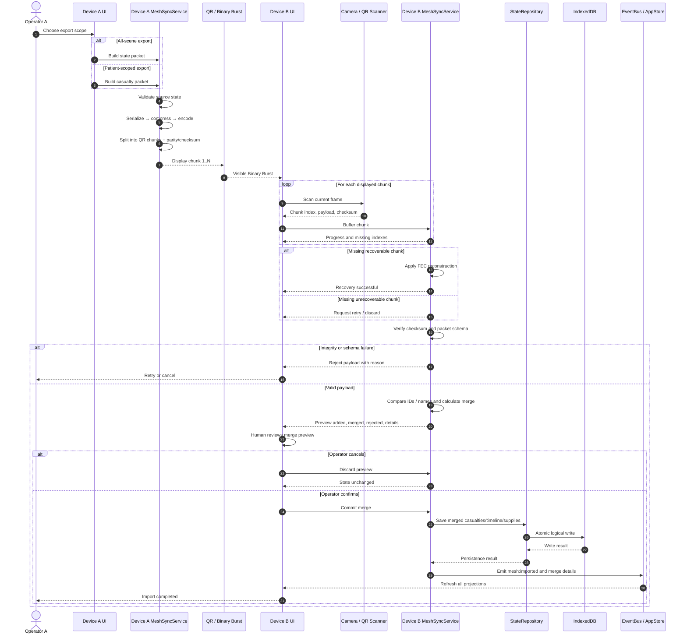
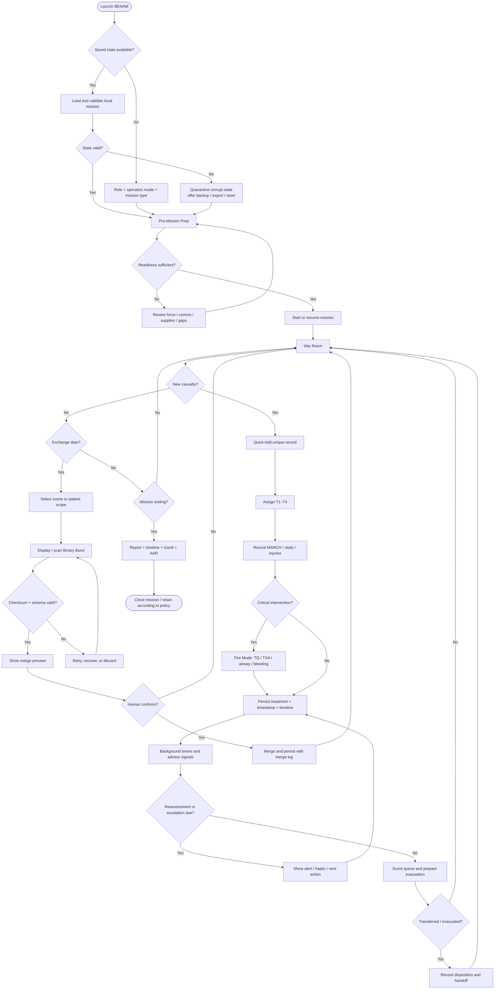

# BENAM Product Requirements Document

**Product:** BENAM — Battlefield Emergency Network & Aid Manager

**Document status:** Master product and implementation specification

**Audience:** Product managers, designers, engineers, QA, security reviewers, deployment operators, and autonomous implementation agents

> This document is the single source of truth for BENAM product intent, launch scope, system behavior, quality standards, and delivery decisions. The current implementation is an offline-first PWA with an Android Capacitor package, local persistence, QR-based data exchange, and no backend. Requirements marked **Current** describe verified repository behavior. Requirements marked **Target** describe the intended production contract. An implementation agent MUST preserve current behavior unless a target requirement explicitly changes it.

## Table of Contents

1. Executive Overview and Product Vision
2. Business Objectives and KPIs
3. User Analysis and Personas
4. Functional Requirements
5. Technical Requirements and Architecture
6. UX/UI Design Specifications
7. Use Cases and User Scenarios
8. Product Roadmap
9. Risk Analysis and Dependencies
10. Acceptance Criteria and Definition of Done
11. Appendices

---

## 1. Executive Overview and Product Vision

## 1.1 Product statement

BENAM is a tactical medical incident-management application for combat medical teams. It guides a team from mission preparation through active casualty care, triage, treatment documentation, evacuation coordination, incident reporting, and after-action review. It is designed to remain useful when internet access, cellular service, cloud infrastructure, and reliable power are unavailable.

The product combines a touch-optimized command interface with clinical workflow support. Its core operating loop is:

```text
Role and mission setup
        ↓
Pre-mission readiness
        ↓
Active incident / War Room
        ↓
Casualty → triage → MARCH → vitals → treatment → evacuation
        ↓
Report and handoff
        ↓
After-action review and team statistics
```

BENAM is decision support and documentation software. It does not replace clinical judgment, a commander's authority, approved medical protocols, or local rules of engagement.

## 1.2 Vision

Enable a small medical team to maintain a reliable, shared, time-aware picture of every casualty and every critical action during the first hour of a tactical medical incident, without depending on a network.

## 1.3 Mission

Provide the minimum cognitive and interaction burden necessary to record the right information, surface time-critical omissions, coordinate evacuation, exchange state between nearby devices, and produce an auditable incident record.

## 1.4 Target audience

### Primary audience

- Combat medics and tactical emergency medical personnel working in austere, noisy, time-critical environments.
- Paramedics and physicians supervising or receiving casualties.
- Small teams operating with Android phones or tablets and intermittent or absent connectivity.

### Secondary audience

- Medical team commanders and incident commanders who need readiness, casualty-priority, evacuation, and team-performance views.
- Casualty collection point and evacuation coordinators.
- Training, simulation, and after-action review facilitators.

### Tertiary audience

- Medical directors and protocol owners maintaining approved decision trees.
- Logistics personnel maintaining medical supply inventories.
- Quality, safety, security, and procurement reviewers.
- Software maintainers and autonomous engineering agents.

## 1.5 Problem statement

In a tactical incident, care decisions, patient state, time-sensitive interventions, supply availability, radio communications, and evacuation status are often recorded across paper tags, memory, verbal handoffs, and disconnected devices. This creates predictable failure modes:

- Critical events are remembered but not timestamped.
- A tourniquet, TXA administration, airway action, or reassessment is not visible to the next caregiver.
- Casualty priority changes faster than the team can communicate them.
- Evacuation requests are incomplete or assembled under stress.
- Devices cannot share state because network access is absent or unsafe.
- Post-incident reconstruction is incomplete, delaying learning and accountability.

## 1.6 Value proposition

BENAM provides one offline operational record for the incident, with:

- Fast casualty capture and four-level triage.
- MARCH tracking, vitals history, treatments, fluids, injuries, photos, and notes.
- Time-aware alerts for tourniquets, Golden Hour, reassessment, SA Pulse, and evacuation.
- Rule-based offline advisor signals that identify missing or delayed actions.
- QR/Binary Burst exchange with validation, checksums, chunk recovery, scope selection, and merge reporting.
- Blood compatibility, dosage, supply, evacuation, communications, reporting, and AAR tools.
- Field controls including Fire Mode, night vision, PIN lock, haptics, one-handed use, RTL Hebrew support, PWA installation, and Android packaging.

## 1.7 Market context and positioning

BENAM occupies the gap between paper tactical casualty cards and connected hospital/enterprise systems. Its differentiator is not cloud analytics; it is resilient local operation under denial, degradation, and disruption.

| Alternative | Strength | Limitation BENAM addresses |
|---|---|---|
| Paper casualty card | Works without power or network | No live aggregation, timers, automated prioritization, or structured AAR |
| Generic notes/forms app | Familiar and flexible | Not organized around MARCH, triage, CASEVAC, or tactical timing |
| Hospital/EMS platform | Rich records and centralized reporting | Usually assumes connectivity, infrastructure, and non-tactical workflows |
| Cloud collaboration tool | Shared real-time state | Network, identity, data-exposure, and availability dependencies |
| BENAM | Offline tactical workflow plus local device exchange | Requires disciplined device custody, validated clinical protocols, and careful sync operations |

## 1.8 Product principles

1. Offline is a product requirement, not an exceptional mode.
2. The fastest safe action must be obvious under stress.
3. Every clinical and operational event should be timestamped and traceable.
4. Automation may highlight risk, but it MUST NOT silently make clinical decisions.
5. Data exchange MUST be explicit, validated, reviewable, and recoverable.
6. The interface MUST degrade gracefully when camera, speech, haptics, storage, or battery features are unavailable.
7. The product MUST be useful for one operator and improve with a team.
8. Privacy and device custody are part of the threat model.

## 1.9 Launch definition

Launch means a tested PWA and Android package that can complete the critical workflow without network access:

```text
Set role → configure mission → verify readiness → start mission
→ add casualty → assign T1–T4 → record MARCH/vitals/treatment
→ prioritize and prepare evacuation → export/import or merge state
→ generate report → complete AAR
```

Clinical deployment additionally requires protocol-owner approval, operational training, device-management policy, and a documented safety review. Software completion alone is not clinical approval.

---

## 2. Business Objectives and KPIs

## 2.1 Short-term objectives: 0–6 months

1. Stabilize the current hybrid JavaScript/TypeScript architecture without breaking the legacy bridge.
2. Achieve reliable completion of the critical offline casualty workflow on supported Android devices and modern Chromium browsers.
3. Establish a versioned protocol/content governance process.
4. Validate QR exchange in realistic lighting, distance, device, and partial-loss conditions.
5. Complete a safety and security review before any operational pilot.
6. Build a repeatable release process for PWA and Android artifacts.
7. Instrument privacy-preserving local quality metrics without transmitting operational data.

## 2.2 Long-term objectives: 6–24 months

1. Pilot with representative tactical medical teams and training organizations.
2. Reduce migration risk by moving remaining legacy behavior behind typed domain contracts.
3. Support signed protocol bundles and controlled configuration distribution without requiring live cloud access.
4. Improve multi-device merge transparency and operator confidence.
5. Provide export formats suitable for authorized training, medical review, and lessons learned.
6. Establish a support, release, and incident-response program appropriate to safety-critical software.
7. Evaluate optional enterprise fleet management and secure distribution only after the offline product is independently valuable.

## 2.3 North Star metric

**Verified Critical Workflow Completion Rate (VCWCR):** the percentage of started missions in a controlled test or pilot session that complete the required sequence of setup, casualty creation, triage, at least one clinical record, evacuation disposition, export/report, and AAR without unrecoverable data loss or unhandled application error.

Formula:

```text
VCWCR = qualifying completed missions / qualifying started missions × 100
```

A qualifying mission is synthetic or explicitly authorized training data. No patient-identifying data may be sent to an analytics service.

**Initial target:** ≥ 98% in automated regression and ≥ 95% in supervised field pilot.
**Desired target by 12 months:** ≥ 99% automated and ≥ 98% supervised pilot.

## 2.4 Leading indicators

- Median time from app launch to mission-ready state: ≤ 60 seconds.
- Median time from incident start to first casualty record: ≤ 20 seconds.
- Percentage of casualty records with required triage, MARCH, and timestamp fields complete.
- QR export success rate and median import recovery time.
- Percentage of sync operations with zero rejected records.
- Alert acknowledgement rate within 30 seconds.
- Offline session crash-free rate.
- Percentage of releases passing typecheck, build, and all critical E2E suites.
- Training task success rate for new operators.

## 2.5 Lagging indicators

- Unrecoverable incident-record loss rate: target 0.
- Duplicate casualty rate after approved merge: target < 0.1% in test data.
- Incorrectly merged casualty rate: target 0 in validation corpus.
- Critical omission detection recall against an approved scenario set: ≥ 95%, with false-positive rate documented by protocol owners.
- Pilot-reported reduction in incomplete handoffs versus baseline.
- Mean time to produce an authorized incident summary.
- Production defect escape rate and mean time to remediate.

## 2.6 KPI governance

Metrics MUST be calculated from synthetic, aggregate, or explicitly consented data. The default product MUST remain telemetry-free. A future opt-in diagnostic channel MUST be separately approved, disabled by default, documented, minimized, and unable to include casualty details, names, free text, photos, audio, or exact operational coordinates.

---

## 3. User Analysis and Personas

## 3.1 User segments

| Segment | Context | Primary need | Product priority |
|---|---|---|---|
| Point-of-care medic | Moving, gloved, interrupted, high cognitive load | Fast safe capture and action prompts | Primary |
| Senior medic/paramedic | Supervises several casualties and caregivers | Prioritization, reassessment, delegation, handoff | Primary |
| Physician/medical authority | Receives complex or high-priority patients | Full clinical context and treatment history | Primary |
| Commander | Coordinates mission and resources | Readiness, aggregate status, evacuation picture | Secondary |
| Evacuation coordinator | Manages LZ, transport, packages, and crew | Queue ordering and 9-LINE preparation | Secondary |
| Trainer/AAR facilitator | Runs simulations and reviews performance | Reproducible data and timeline | Tertiary |
| Protocol administrator | Maintains approved clinical guidance | Controlled content/versioning | Tertiary |

## 3.2 Environmental and behavioral constraints

Users may be wearing gloves, have poor lighting, have one free hand, be under fire, have low battery, use a damaged screen, operate in Hebrew RTL, speak rather than type, and share a device or transfer responsibility. The product MUST assume interruptions and recoverable partial completion.

## 3.3 Personas

### Persona P1: Noam, point-of-care medic

- **Profile:** 20–35, highly trained field medic, Android-first, intermittent device access.
- **Goals:** Stop preventable deterioration, record only what matters, hand off confidently, avoid losing data.
- **Frustrations:** Deep forms, tiny controls, repeated typing, unclear alert priority, unreliable connectivity.
- **Behaviors:** Uses Quick Add and Fire Mode; records interventions immediately; returns to detail only when safe; relies on color, timers, and haptics.
- **Success signal:** Can create and triage a casualty in seconds and see the next critical action without leaving the incident view.

### Persona P2: Maya, senior medic/paramedic

- **Profile:** 28–45, manages several casualties and a small medical team.
- **Goals:** Maintain the shared casualty picture, assign caregivers, detect deteriorating or overdue patients, prepare evacuation.
- **Frustrations:** Data scattered across devices, ambiguous timestamps, stale verbal updates, duplicate records.
- **Behaviors:** Switches between matrix, triage, MARCH, blood, and card views; reviews timelines; initiates mesh export/import.
- **Success signal:** Can identify the highest-risk patient and the missing handoff information at a glance.

### Persona P3: Dr. Amir, receiving physician

- **Profile:** 35–55, clinical authority receiving a handoff or managing a collection point.
- **Goals:** Verify history, treatment, vitals, blood, and evacuation state; make informed decisions quickly.
- **Frustrations:** Unstructured notes, unknown provenance, missing times, inability to reconcile two devices.
- **Behaviors:** Uses casualty profile, vitals history, treatment log, and timeline; checks merge log before trusting imported data.
- **Success signal:** Receives a concise, chronological, provenance-aware record.

### Persona P4: Yael, commander or evacuation coordinator

- **Profile:** 30–50, operational decision maker, may not deliver direct care.
- **Goals:** Know readiness, casualty counts by priority, resource constraints, evacuation order, and team status.
- **Frustrations:** Clinical detail obscures operational status; updates arrive late; no offline shared dashboard.
- **Behaviors:** Uses Prep readiness, War Room aggregate views, evacuation queue, 9-LINE generator, and reports.
- **Success signal:** Can make a resource or evacuation decision without asking every medic for a separate update.

### Persona P5: Omer, trainer and protocol owner

- **Profile:** 30–60, responsible for safe training and approved workflows.
- **Goals:** Reproduce scenarios, evaluate performance, control protocol versions, prevent unsupported medical guidance.
- **Frustrations:** Unverifiable app behavior, opaque algorithm changes, inability to distinguish training from real data.
- **Behaviors:** Uses synthetic missions, AAR, timeline, KPI dashboard, and release notes.
- **Success signal:** Can trace a behavior to a versioned protocol, test, or decision record.

## 3.4 Pain-point mapping

| Pain point | Affected users | BENAM response |
|---|---|---|
| Network unavailable | All | Local-first persistence, service worker, QR exchange |
| Casualty overload | Medics, commanders | Triage, matrix, evacuation scoring, NAE |
| Time-critical omission | Medics, physicians | Timers and background alerts |
| Incomplete handoff | Receiving physician, senior medic | Timeline, treatment log, report, QR scope export |
| Duplicate or conflicting records | Teams | Identity matching, validation, worst-of MARCH merge, merge log |
| Poor field ergonomics | Point-of-care medic | Fire Mode, touch controls, night mode, haptics, RTL |
| Weak learning loop | Trainers, commanders | Timeline, Gantt, Hero Score, AAR |

## 3.5 Critical user journeys and emotional states

### Journey J1: Prepare and start a mission

```text
Entry: app launch
  ↓ [uncertainty] Tutorial or role setup
  ↓ [orientation] Select role, operation mode, mission type
  ↓ [control] Review force, supplies, communications, readiness
  ↓ [confidence] Start Mission
  ↓ [focus] War Room with active timers and casualty count
Exit: active incident state
```

The system MUST preserve selected role, readiness data, and mission parameters across reloads. If setup is incomplete, it MUST show actionable gaps without preventing an authorized user from proceeding unless a hard safety rule is configured.

### Journey J2: Capture and stabilize a casualty

```text
Entry: injury reported
  ↓ [urgency] Quick Add or Fire Mode
  ↓ [focus] Select casualty / create unique record
  ↓ [clarity] Set T1–T4 and key identity fields
  ↓ [action] Record MARCH, TQ, TXA, vitals, blood, fluids, notes
  ↓ [relief] Observe timers, alerts, and next-action cues
  ↓ [handoff readiness] Assign medic and evacuation state
Exit: stabilized, transferred, or disposition recorded
```

The user MUST be able to interrupt any optional field and return without losing committed values. High-risk actions MUST provide visible confirmation or reversible feedback.

### Journey J3: Exchange data between devices

```text
Entry: operator opens Sync Master
  ↓ [intent] Choose all-scene or specific-casualty scope
  ↓ [preparation] Generate QR Binary Burst
  ↓ [concentration] Display or scan chunks
  ↓ [uncertainty] Missing/corrupt chunk?
  ├─ Yes → use parity/retry → return to scan
  └─ No  → validate checksum and schema
  ↓ [review] Show added, merged, rejected records and details
  ↓ [trust] Explicitly confirm import
Exit: local state updated or import safely rejected
```

### Journey J4: Close and learn from an incident

```text
Entry: evacuation or mission end
  ↓ [completion] Verify unresolved casualties and pending actions
  ↓ [accountability] Review report, timeline, Gantt, and KPIs
  ↓ [reflection] Generate structured AAR
  ↓ [learning] Record findings and export authorized artifact
Exit: closed training/incident record
```

---

## 4. Functional Requirements

## 4.1 Prioritization and complexity scale

MoSCoW priority is normative for planning. Complexity is relative engineering effort: **S** ≤ 3 engineer-days, **M** = 4–10, **L** = 11–25, **XL** > 25, including tests and review. Complexity estimates assume the existing stack and are not commitments to staffing.

## 4.2 Must Have: critical for launch

### FR-M01: Role, operation mode, and mission setup
- **Description:** Provide role selection for Commander, Medic, Paramedic, and Physician; operation mode selection; mission type selection; and role-based equipment presets.
- **User value:** Establishes context and reduces setup work.
- **Acceptance criteria:** Role and mode are selectable; a default role exists when setup is skipped; selected values persist after reload; mission start creates an active state and timeline event; unsupported combinations are rejected with an actionable message.
- **Dependencies:** Local state repository, screen manager, mission types.
- **Complexity:** M. **Status:** Current.

### FR-M02: Pre-mission readiness hub
- **Description:** Manage force roster, communications parameters, supplies, readiness checks, and pre-mission brief.
- **User value:** Reduces preventable omissions before departure.
- **Acceptance criteria:** User can add/edit/remove force members; configure unit/comms values; view supply state; see readiness gaps; generate a brief; start mission; empty states are usable.
- **Dependencies:** FR-M01, state persistence, supply and personnel models.
- **Complexity:** L. **Status:** Current.

### FR-M03: Mission lifecycle and local persistence
- **Description:** Create, update, resume, and close a mission using IndexedDB as primary persistence and localStorage fallback.
- **User value:** Prevents loss across reloads and temporary application restarts.
- **Acceptance criteria:** State survives reload; writes are atomic at the logical state level; fallback is invoked when IndexedDB is unavailable; schema version is stored; corrupt state is detected and recoverable without silently overwriting valid data.
- **Dependencies:** Storage adapter, repository, schema validation.
- **Complexity:** L. **Status:** Current/Target hardening.

### FR-M04: War Room aggregate incident view
- **Description:** Show active casualties, counts, priorities, alerts, next actions, and view switcher for matrix, triage, MARCH, blood, and cards.
- **User value:** Gives the team one operational picture.
- **Acceptance criteria:** View opens after mission start; casualty count updates immediately; all supported views are reachable; stale or empty states are explicit; critical alert state is visually distinct; no single casualty blocks the whole view.
- **Dependencies:** FR-M03, casualty model, background services.
- **Complexity:** L. **Status:** Current.

### FR-M05: Rapid casualty creation and identity
- **Description:** Quick Add creates a unique casualty record with required defaults; detailed profile supports name, identifier, age/weight where applicable, injuries, blood, allergies, photos, notes, buddy, and assigned medic.
- **User value:** Enables capture in seconds and richer documentation later.
- **Acceptance criteria:** Two rapid additions have unique IDs; a detail drawer opens; committed fields persist; invalid numeric or enumerated values are rejected; photo permission denial does not block text workflow.
- **Dependencies:** FR-M03, casualty validation, camera capability where available.
- **Complexity:** L. **Status:** Current.

### FR-M06: Triage and MARCH tracking
- **Description:** Support T1–T4 priority and MARCH categories with explicit status and timestamps.
- **User value:** Makes priority and immediate care status visible.
- **Acceptance criteria:** Triage changes update state and timeline; MARCH actions are individually recordable; the most urgent state is not silently downgraded by sync; all updates identify casualty and time; undo or correction path exists.
- **Dependencies:** FR-M05, timeline, merge policy.
- **Complexity:** L. **Status:** Current.

### FR-M07: Vitals history and treatment log
- **Description:** Record current vitals, repeated measurements, treatments, tourniquet start, TXA, fluids, blood, airway actions, and treatment times.
- **User value:** Supports trend recognition and handoff accuracy.
- **Acceptance criteria:** Pulse and other supported fields save; each history entry has timestamp and author/device context where available; treatment entries are append-only by default; edits create audit information; invalid values receive field-level feedback.
- **Dependencies:** FR-M05, timeline, local persistence.
- **Complexity:** L. **Status:** Current/Target audit hardening.

### FR-M08: Time-critical monitoring and offline advisor
- **Description:** Run Golden Hour, TQ, SA Pulse, reassessment, helicopter/evacuation countdown, and auto-escalation services; provide rule-based signals for missing TXA, untreated airway, hypothermia risk, and delayed TQ.
- **User value:** Surfaces time-sensitive omissions without requiring memory.
- **Acceptance criteria:** Timers remain correct after reload using timestamps; TQ warning is throttled and visible; alerts identify casualty and reason; rules are deterministic, versioned, testable, and clearly labeled as decision support; no alert silently changes care data.
- **Dependencies:** FR-M03, background service manager, event bus.
- **Complexity:** XL. **Status:** Current; protocol validation required.

### FR-M09: Evacuation queue and CASEVAC support
- **Description:** Calculate evacuation priority, assign medical authority and capacity, maintain pipeline stages, manage LZ and crew data, and generate 9-LINE content.
- **User value:** Converts casualty state into an actionable evacuation order.
- **Acceptance criteria:** Queue ordering reflects documented scoring inputs; T1 receives the documented critical boost; score reasons are inspectable; capacity limits are enforced; 9-LINE output is complete or flags missing fields; manual override is possible and logged.
- **Dependencies:** FR-M06, FR-M07, force roster, mission data.
- **Complexity:** XL. **Status:** Current/Target clinical governance.

### FR-M10: Secure local access and field operation
- **Description:** Provide PIN lock, night/red display mode, haptic critical alerts, touch-friendly one-handed navigation, and non-blocking notifications.
- **User value:** Protects local data and supports field conditions.
- **Acceptance criteria:** PIN lock obscures protected data; failed attempts do not expose content; night mode persists as configured; unsupported haptics fail silently; alerts do not trap the user in a modal loop.
- **Dependencies:** Platform APIs, FR-M03.
- **Complexity:** M. **Status:** Current/Target security hardening.

### FR-M11: Explicit QR/Binary Burst export and import
- **Description:** Export all-scene or casualty-scoped state as chunked QR data with checksum and forward-error recovery; scan, validate, reconstruct, preview, merge, and report results.
- **User value:** Enables device-to-device exchange without a network.
- **Acceptance criteria:** Scope is explicit; chunks show progress; one recoverable missing chunk can be reconstructed when parity permits; corrupted payload is rejected; schema-invalid records are rejected; import preview shows added/merged/rejected counts and details; no state changes before confirmation.
- **Dependencies:** FR-M03, camera/QR capability, mesh sync service.
- **Complexity:** XL. **Status:** Current.

### FR-M12: Reporting, timeline, statistics, and AAR
- **Description:** Provide chronological timeline, Gantt view, KPI summary, Hero Score, report, and structured AAR generation.
- **User value:** Preserves accountability and enables learning.
- **Acceptance criteria:** Events are ordered deterministically; report distinguishes missing data; AAR is generated from local state; user can review before export; training and operational records are clearly labeled.
- **Dependencies:** FR-M06–FR-M09, export mechanism.
- **Complexity:** L. **Status:** Current.

### FR-M13: Offline install and Android distribution
- **Description:** Deliver installable PWA and Capacitor Android package with cached app shell and local assets.
- **User value:** Makes the tool usable as a standalone field application.
- **Acceptance criteria:** App shell loads without network after an initial successful build/install; Android artifact launches; camera and filesystem permission failures are handled; build output is reproducible; service-worker cache is versioned.
- **Dependencies:** Vite, service worker, Capacitor, Android toolchain.
- **Complexity:** L. **Status:** Current.

### FR-M14: Safety, provenance, and protocol boundaries
- **Description:** Clearly label rule-based advice, protocol version, data source, merge provenance, and operational/training status.
- **User value:** Prevents overtrust and supports review.
- **Acceptance criteria:** Every advisor rule displays its name/version or reference; imported fields are distinguishable from local fields where relevant; manual overrides are logged; the product states that it does not replace clinical judgment; protocol changes are reviewed and tested.
- **Dependencies:** All clinical features, release process.
- **Complexity:** L. **Status:** Target launch gate.

## 4.3 Should Have: important but not launch-blocking

| ID | Requirement | Acceptance summary | Dependencies | Complexity |
|---|---|---|---|---|
| FR-S01 | Typed replacement for remaining legacy workflows | Critical behavior is behind typed contracts with parity tests; no duplicate source of truth | FR-M3, bridge | XL |
| FR-S02 | Signed offline protocol bundles | Verify signature, version, issuer, expiry, and rollback before activation | Security model, key custody | XL |
| FR-S03 | Encrypted local database at rest | Protect data on supported platforms with documented key lifecycle and recovery behavior | Platform keystore | XL |
| FR-S04 | Authorized export formats | Produce human-readable and machine-readable exports with redaction controls | Reporting | L |
| FR-S05 | Conflict-resolution workspace | Let an operator inspect field-level conflicts before merge | Mesh sync | L |
| FR-S06 | Formal device capability diagnostics | Show storage, camera, haptics, speech, battery, and browser support status | Platform adapters | M |
| FR-S07 | Test scenario pack and replay | Load synthetic scenarios and replay timelines for training | AAR, import | L |
| FR-S08 | Localization framework | Hebrew RTL remains supported; English and additional locale strings are externalized | UI surface | L |
| FR-S09 | Operational audit export | Export an append-only event digest without raw photos/audio by default | Timeline, security | M |

## 4.4 Could Have: desirable if resources permit

| ID | Requirement | Rationale | Complexity |
|---|---|---|---|
| FR-C01 | Bluetooth or local Wi-Fi exchange adapter | Faster exchange where policy permits, while QR remains the fallback | XL |
| FR-C02 | Optional encrypted team relay | Enables remote coordination only when explicitly enabled and approved | XL |
| FR-C03 | Voice command capture | Reduces typing, with confirmation and Hebrew/English fallback | L |
| FR-C04 | Protocol simulation mode | Supports education without mixing with real missions | M |
| FR-C05 | Configurable mission templates | Reduces repetitive setup for recurring units | M |
| FR-C06 | Hardware barcode/NFC support | Accelerates casualty identity when approved hardware exists | L |
| FR-C07 | Offline map overlays | Improves LZ planning only with approved, locally packaged maps | XL |

## 4.5 Won’t Have: explicitly out of scope for the 24-month baseline

- Unauthenticated cloud storage of casualty records: conflicts with threat model and privacy boundary.
- Automatic remote telemetry containing operational, location, medical, or identifying information: conflicts with zero-telemetry default.
- Autonomous diagnosis, treatment prescription, or clinical decision replacement: unsafe and outside product role.
- Fully automatic casualty identity matching without human confirmation: unacceptable false-merge risk.
- Public social, messaging, or consumer collaboration features: not relevant to mission workflow.
- Dependence on a live map, GPS, cellular network, or third-party API for the core workflow: violates offline requirement.
- Unreviewed protocol or algorithm changes delivered at runtime: violates clinical governance.

## 4.6 Cross-feature data rules

1. Every casualty MUST have a stable local identifier and creation timestamp.
2. Every clinical event MUST retain event time; device receive time MAY be retained separately.
3. Collections such as treatments, vitals, injuries, and timeline events MUST use deterministic deduplication keys.
4. Merging MUST be monotonic for safety-critical state unless an authorized human explicitly corrects it.
5. Import MUST be previewed and confirmed before mutation.
6. Deletion MUST be deliberate and MUST preserve an audit marker where policy requires.
7. Free text and photos MUST be treated as sensitive and excluded from diagnostics by default.

---

## 5. Technical Requirements and Architecture

## 5.1 Current stack baseline

| Layer | Required technology | Current implementation |
|---|---|---|
| Client UI | HTML5, CSS3, vanilla JavaScript, TypeScript | Hybrid legacy JS and strict TypeScript |
| Build | Vite | Vite with concatenation, asset-copy, and service-worker plugins |
| Runtime | Modern Chromium; Android WebView through Capacitor | PWA plus Android APK |
| Persistence | IndexedDB primary; localStorage fallback | Local adapters and state repository |
| Offline | Service Worker and Cache API | Versioned cached shell/assets |
| QR/sync | Canvas QR/chunking, checksum/FEC logic | Binary Burst and mesh merge services |
| Native bridge | Capacitor Android | Camera, filesystem, notifications, status bar, keyboard, splash |
| Test | Playwright E2E, TypeScript strict check | Multiple critical workflow suites |
| Delivery | GitHub Actions | Typecheck → build → E2E |
| Backend | None for core product | MUST remain optional and disabled by default |

## 5.2 Logical architecture

### 5.2.1 Component architecture diagram

The following diagram is the normative component map for the current hybrid architecture. Solid arrows represent runtime calls or emitted events. Dashed arrows represent compatibility, persistence, or optional capability boundaries.



### 5.2.2 Component ownership rules

| Component boundary | Owns | MUST NOT own |
|---|---|---|
| Legacy UI | Existing DOM handlers and compatibility rendering during migration | New clinical rules or a second persistence model |
| Presentation | User interaction, screen state, view projection, action routing | Direct clinical scoring or storage format decisions |
| Domain | Validation, business rules, merge policy, scoring, event semantics | DOM access, browser-specific assumptions, hidden network calls |
| Background | Time-derived monitoring and alert events | Direct clinical mutation without a domain command |
| Data | Serialization, persistence, schema/recovery, backup | UI decisions or silent conflict resolution |
| QR exchange | Encoding, chunking, integrity, transport progress | Trust decisions without validation and human confirmation |

### 5.2.3 Deployment architecture diagram



```text
+--------------------------- CLIENT / DEVICE TRUST BOUNDARY ---------------------------+
|                                                                                     |
|  +------------------+     events/actions      +-------------------------------+     |
|  | PWA / Android UI  | ↔──────────────────────→| Presentation: Store, Screens,|     |
|  | RTL, Fire, Night  |                         | Delegator, Feature Facades   |     |
|  +--------+---------+                         +---------------+---------------+     |
|           |                                                   |                     |
|           | Web APIs / Capacitor                              | DI / EventBus       |
|           ↓                                                   ↓                     |
|  +------------------+   domain commands   +-----------------------------------+     |
|  | Camera, Speech,   | ↔────────────────→ | Domain Services                   |     |
|  | Haptics, Notify   |                    | Casualty, Triage, MARCH, Vitals,  |     |
|  +------------------+                     | Blood, Supply, Evac, Timeline,    |     |
|                                           | Mesh Sync                         |     |
|                                           +----------------+------------------+     |
|                                                           |                         |
|                                                           | Repository API          |
|                                                           ↓                         |
|  +-------------------+      IndexedDB      +----------------+------------------+    |
|  | Service Worker /  | ↔────────────────→ | State Repository / Storage Adapter |    |
|  | Cache API         |                    | schema, validation, fallback       |    |
|  +-------------------+                    +----------------+------------------ +    |
|                                                           |                         |
|                                                           ↓                         |
|                                          +-----------------------------------+      |
|                                          | Local data: mission, casualties,  |      |
|                                          | timeline, supplies, comms, keys   |      |
|                                          +-----------------------------------+      |
+-------------------------------------------------------------------------------------+
              explicit QR/Binary Burst only; camera scan/display; human confirmation
+-------------------------------- EXTERNAL BOUNDARY ----------------------------------+
| Optional future: signed protocol bundles, approved export destination, MDM.         |
| No external service is required for setup, care, reporting, or local recovery.      |
+-------------------------------------------------------------------------------------+
```

## 5.3 Data flow and trust boundaries

### 5.3.1 Trust-boundary data-flow diagram





- Untrusted input: camera QR frames, imported JSON, speech recognition output, user-entered values, and legacy bridge values.
- Trusted after validation: normalized domain entities accepted by schema and business rules.
- Sensitive boundary: local persistence, screen rendering, export previews, and device backup.
- Clinical boundary: advisor output and scoring are suggestions; human action is required.
- Synchronization boundary: imported data is never trusted merely because it came from a known device.

## 5.4 Domain model

Minimum entities:

- **Mission:** role, operation mode, mission type, active/closed status, start/end time, communications, force roster, configuration, protocol version.
- **Casualty:** stable ID, identity fields, priority T1–T4, injuries, MARCH, vitals, vitals history, treatments, fluids, blood, TQ timestamp, evacuation pipeline, assigned medic, notes, photos, provenance.
- **TimelineEvent:** event ID, casualty/mission reference, event type, payload summary, event time, device/source, author where available.
- **SupplyInventory:** item quantities, adjustments, source, time.
- **MeshPayload:** packet kind, export timestamp, scope, casualties, timeline, supplies, schema version, checksum, chunk metadata.
- **AdvisorSignal:** deterministic rule ID, severity, casualty reference, reason, created time, acknowledgement state, protocol version.

The implementation MUST maintain one canonical serialization format per schema version. Unknown fields MUST be preserved where feasible or rejected with a clear migration result; silent dropping is prohibited for clinical fields.

## 5.5 API and integration contracts

### 5.5.1 Internal service interaction diagram




The core product exposes internal TypeScript service contracts rather than a network API:

```text
CasualtyService.create/update/remove/get
TriageService.assignPriority
MarchService.updateCategory
VitalsService.record
BloodService.checkCompatibility
SupplyService.adjust/get
EvacuationService.score/queue/assign
TimelineService.append/query
MeshSyncService.validate/merge
StateRepository.load/save/replace
```

Contract requirements:

- Methods MUST validate inputs and return typed success/error results or throw documented domain errors.
- Methods MUST be deterministic for the same state, input, and protocol version.
- Services MUST NOT access DOM globals directly except through explicit adapters.
- All mutation paths MUST emit a domain event or append a timeline record when clinically or operationally meaningful.
- The legacy bridge MUST be treated as a compatibility layer, not a second business-logic owner.

### Optional external integration contract

No external API is required for launch. Future integrations MUST use an adapter with:

- explicit enablement and policy check;
- authenticated, encrypted transport;
- bounded retries and offline queue;
- idempotency key;
- schema/version negotiation;
- redaction policy;
- operator-visible success/failure state;
- no effect on local mission operation when unavailable.

### 5.5.2 QR / mesh synchronization sequence diagram

This sequence is the normative behavior for device-to-device exchange. The receiver MUST NOT mutate mission state before integrity, schema, merge preview, and human confirmation have completed.



## 5.6 Security requirements

1. The app MUST use least-privilege platform permissions.
2. PIN lock MUST not be treated as equivalent to cryptographic encryption.
3. Sensitive local data SHOULD be encrypted at rest on platforms that provide a secure keystore; the key MUST not be stored beside the data.
4. QR payloads MUST include schema validation, integrity protection, bounded size, and replay/duplicate handling. Confidentiality SHOULD be available through an approved encryption mode before operational use.
5. Imported content MUST be treated as hostile input and bounded for memory, recursion, string size, chunk count, and image size.
6. The app MUST avoid logging casualty names, notes, photos, audio, identifiers, or full payloads in console or crash output.
7. Debugging and WebView inspection MUST be disabled in production artifacts unless an authorized diagnostic build is used.
8. Every release MUST undergo dependency review, static checks, abuse-case review, and permission review.
9. PIN brute force mitigation, session timeout policy, and secure wipe behavior MUST be configurable by deployment policy.
10. Security incidents MUST have a documented triage, containment, disclosure, and recovery procedure.

## 5.7 Privacy and compliance

The product MUST be privacy-by-design and support GDPR/UK GDPR and CCPA/CPRA principles where applicable, while recognizing that military, emergency, or health-data exemptions may change the legal basis. Legal counsel and the deploying organization determine the final classification.

Required controls:

- Data minimization and purpose limitation.
- Local-only default and no hidden transmission.
- Clear classification of casualty, photo, voice, and location data.
- Retention and secure deletion policy configurable by deployment.
- Export, correction, and access procedures for authorized data subjects where legally applicable.
- Privacy impact assessment before any network service, telemetry, analytics, or cloud backup.
- Consent/notice language for voice, photos, and training scenarios where required.
- No production patient data in tests, fixtures, screenshots, or issue reports.

## 5.8 Performance and resilience benchmarks

- Cold start to interactive: ≤ 3 seconds on supported Android reference device.
- Mission state mutation acknowledgement: ≤ 250 ms p95 locally.
- War Room update after casualty mutation: ≤ 500 ms p95 for 20 active casualties.
- Support at least 100 casualties and 10,000 timeline events per mission without functional degradation.
- QR export of a 20-casualty synthetic mission: ≤ 5 seconds excluding camera display time.
- QR import and preview: ≤ 5 seconds after final chunk for the same reference payload.
- No unbounded timer, listener, or merge-memory growth during a 4-hour synthetic mission.
- App remains usable when camera, speech, haptics, notification, or IndexedDB features fail individually.

## 5.9 Backup and disaster recovery

- Local state MUST be exportable through an explicit, operator-controlled artifact.
- The app MUST offer a recovery path when state fails schema validation: preserve the original, identify the version, and offer a safe export or reset.
- Backup artifacts MUST be integrity-checked and, for operational deployment, encrypted according to policy.
- Recovery Point Objective: ≤ 5 minutes when the operator performs recommended export cadence; zero guaranteed only for committed local writes.
- Recovery Time Objective: ≤ 15 minutes on a prepared replacement device for a valid backup.
- A restore MUST be previewed and confirmed; it MUST not silently replace an active mission.
- Release rollback MUST preserve compatibility with the previous two supported schema versions or provide a tested migration.

---

## 6. UX/UI Design Specifications

## 6.1 Design principles

- **Action before decoration:** prioritize legibility, target size, and status.
- **Progressive disclosure:** show urgent facts first; detailed documentation remains one deliberate step away.
- **Stable spatial memory:** controls retain positions across states and view modes.
- **Color is supplemental:** every clinical status has text, icon, shape, or pattern support.
- **No hidden mutation:** imports, deletes, overrides, and state merges are reviewable.
- **Field-first ergonomics:** touch targets, one-handed reach, glove tolerance, contrast, and interruption recovery are mandatory.
- **RTL and localization by construction:** direction, text expansion, and mixed medical notation are tested.

## 6.2 Design system foundations

- Typography MUST use a legible Hebrew/Latin family with tested numerals and medical abbreviations.
- Minimum body text: 16 CSS px in normal views; emergency controls MAY use larger text.
- Touch target: minimum 44 × 44 CSS px; critical Fire Mode controls SHOULD be at least 56 × 56.
- Contrast: WCAG 2.2 AA minimum; critical status text SHOULD meet AAA where practical.
- Status palette: red for immediate criticality, amber for warning, green for complete/ready, blue/neutral for information. Status MUST never rely on hue alone.
- Motion MUST be short, interruptible, and disabled or reduced under `prefers-reduced-motion`.
- Dialogs MUST not obscure the only critical status or prevent emergency navigation.

## 6.3 Screen specifications

### S01 Role Selection

- Header: BENAM identity, language/direction, help/accessibility controls.
- Main: role choices, operation mode, mission type, continue/skip action.
- Interaction: selected role is visibly persistent; skip assigns a safe default and explains the consequence.
- Empty/error: if configuration cannot load, show local recovery and default setup.

### S02 Pre-Mission Prep

- Header: mission identity, readiness status, lock/night controls.
- Content: readiness summary, force, communications, supplies, brief, evacuation configuration.
- Interaction: sub-tabs preserve context; incomplete readiness items link directly to correction.
- Empty state: explain what is missing and provide a single next action.

### S03 War Room

- Header: active mission, elapsed/Golden Hour time, alert summary, Fire Mode control.
- Main: casualty count, priority bands, active alerts, view switcher, Quick Add.
- Secondary: matrix, triage, MARCH, blood, card views.
- Interaction: selecting a casualty opens detail without losing aggregate context; critical alert can be acknowledged but not erased from timeline.

### S04 Fire Mode

- Full-screen minimal surface with selected casualty, large MARCH/TQ/TXA/airway/bleeding actions, timer, and exit control.
- Actions MUST be high contrast, stable, and confirmable through visual state change.
- The selected casualty MUST be visible at all times; switching patient MUST require deliberate action.

### S05 Casualty Profile

- Drawer or full-screen detail view with identity, triage, MARCH, vitals, treatments, injuries, fluids, blood, evacuation, notes, photos, and timeline.
- Required versus optional fields MUST be visually distinct.
- Save behavior MUST be explicit for compound edits or clearly immediate with confirmation.

### S06 Blood Bank and Supplies

- Blood compatibility matrix, inventory counts, adjustment history, and warnings.
- Incompatible selection MUST be blocked or require an explicit authorized override with reason.

### S07 Report and Evacuation

- Evacuation queue ordered by score with reasons and manual override state.
- 9-LINE form with field completeness and copy/export controls.
- Report preview MUST identify missing, estimated, imported, and manually overridden data.

### S08 Stats, Timeline, and AAR

- KPI summary, casualty timeline, Gantt visualization, Hero Score, AAR sections, and export/review.
- Charts MUST have a text/table alternative and remain readable on narrow screens.

### S09 Sync Master

- Tabs: status, export, receive.
- Export: scene/patient scope selector, payload summary, chunk count, Binary Burst controls.
- Receive: camera/scanner state, progress, missing chunks, integrity result, preview, merge confirmation.
- Merge result MUST show added/merged/rejected counts and per-record details.

## 6.4 Primary flow diagram

### 6.4.1 Mission and casualty workflow diagram



### 6.4.2 Operational UI flow contract

The flow above is not merely illustrative. Every decision point MUST have a visible state, an actionable next step, and a safe terminal state. Loops MUST preserve committed state and MUST NOT create duplicate casualties, duplicate treatments, or duplicate timeline events when the same action is retried.

```text
+---------+     +--------------+     +----------------+     +------------+
| Launch  | →   | Role / Mode  | →   | Prep / Ready   | →   | Start      |
+---------+     +--------------+     +----------------+     +------------+
                               │ not ready
                               └──────────────→ [Review gap] ↺
                                                               ↓
                                                        +-------------+
                                                        | War Room    |
                                                        +------+------+
                                                               │
                         +-------------------------------------+----------------------------------+
                         ↓                                     ↓                                  ↓
                  +-------------+                       +-------------+                     +----------+
                  | Quick Add   |                       | Fire Mode   |                     | Sync     |
                  +------+------+                       +------+------+                     +----+-----+
                         ↓                                     ↓                                  ↓
                  +-------------+                       +-------------+                     +----------+
                  | Triage      | → MARCH / Vitals →   | Treatment   | → Evacuation / Report | Acknowledge|
                  +-------------+                       +-------------+                     +----------+
                         ↓                                     ↓                                  ↓
                         +--------------------→ Timeline / AAR ←-------------------------------+
```

## 6.5 Error and empty states

- **No casualties:** explain that Quick Add creates the first record; do not show a blank grid with no action.
- **No supplies:** distinguish zero inventory from unavailable inventory data.
- **Invalid vitals:** keep the user's draft, identify field and accepted range, and never coerce silently.
- **Storage unavailable:** show degraded mode, warn about persistence risk, and provide export/retry; never claim a save that did not complete.
- **QR corruption:** identify integrity failure, retain valid scanned chunks, offer retry or discard.
- **QR schema rejection:** show reason/category, do not mutate state.
- **Merge conflict:** show both values and resolution rule; require confirmation for ambiguous identity.
- **Permission denied:** continue with available capabilities and surface a nonblocking explanation.
- **Timer backgrounded:** recompute from timestamps on resume; never rely only on elapsed JavaScript ticks.
- **Unexpected exception:** preserve local state if possible, provide recovery/export, and avoid sensitive logs.

## 6.6 Accessibility

Target WCAG 2.2 AA for all supported workflows, with these additional requirements:

- Full keyboard navigation for desktop/PWA use.
- Logical focus order and visible focus indicator.
- Screen-reader names for icon-only controls and live regions for critical alerts.
- No color-only triage or severity meaning.
- Reduced-motion support.
- Text zoom to 200% without loss of critical function where platform permits.
- Hebrew RTL and mixed-direction numeric/medical text tested with screen readers.
- Captions/transcripts or textual alternatives for voice-derived content.
- Automated axe checks plus manual keyboard and screen-reader review for each release candidate.

## 6.7 Responsive behavior

- **Phone portrait:** single-column priority workflow; bottom or reachable navigation; casualty detail as full-screen drawer.
- **Phone landscape:** two-pane War Room when width permits; preserve critical controls.
- **Tablet:** matrix plus detail pane; larger charts and queue comparison.
- **Desktop:** persistent navigation and multi-column operations view; never make desktop the only usable layout.
- Layout MUST tolerate safe areas, keyboard resize, status bar overlays, Hebrew text expansion, and 320 CSS px minimum width.

---

## 7. Use Cases and User Scenarios

## UC-01: Start a mission

- **Trigger:** Operator opens BENAM before deployment.
- **Actor:** Medic, commander, or authorized operator.
- **Preconditions:** App installed or loaded; no network required.
- **Main flow:**
  1. App loads cached shell and local state.
  2. Operator selects role, mode, and mission type or accepts safe default.
  3. Operator reviews force, comms, supplies, and readiness.
  4. Operator corrects blocking gaps or explicitly proceeds.
  5. System records mission start and opens War Room.
- **Postconditions:** Active mission exists locally; timer anchor and timeline start event are stored.
- **Expected response:** War Room is interactive and shows zero or more casualties.
- **Alternative flows:** Existing active mission resumes; tutorial is skipped; persistence is unavailable and a degraded-mode warning appears.
- **Exceptions:** Corrupt state is quarantined; user receives recovery options; no silent reset.
- **Boundary conditions:** Repeated start requests are idempotent or require confirmation; clock changes are detected and surfaced.

## UC-02: Create and triage a casualty

- **Trigger:** New casualty arrives.
- **Actor:** Point-of-care medic.
- **Preconditions:** Active mission, local UI available.
- **Main flow:**
  1. Operator taps Quick Add or enters Fire Mode.
  2. System creates unique ID and default record.
  3. Operator selects T1–T4.
  4. System persists priority and appends timeline event.
  5. Operator adds identity and immediate MARCH observations.
- **Postconditions:** Casualty appears in aggregate views and is eligible for evacuation scoring.
- **Alternative flows:** Operator continues with unknown identity; device has no camera; user switches to another casualty.
- **Exceptions:** Invalid input is rejected at field level; failed save retains draft and exposes retry/export.
- **Boundary conditions:** At least 100 synthetic casualties MUST remain navigable; duplicate IDs MUST never be generated.

## UC-03: Record a critical intervention

- **Trigger:** Operator applies TQ, TXA, airway action, blood, fluid, or other supported intervention.
- **Actor:** Medic or paramedic.
- **Preconditions:** Casualty selected; mission active.
- **Main flow:**
  1. Operator selects action.
  2. System records event time and treatment details.
  3. TQ starts an elapsed timer; relevant advisor and reassessment rules recalculate.
  4. War Room and casualty detail update.
  5. Timeline records the intervention.
- **Postconditions:** Treatment is visible, timestamped, and included in handoff/report.
- **Alternative flows:** Operator corrects an entry; imported treatment is merged; device resumes after backgrounding.
- **Exceptions:** Treatment cannot be saved; system shows unsaved state and does not display false completion.
- **Boundary conditions:** Clock rollover, timezone change, duplicate tap, and repeated treatment are handled deterministically.

## UC-04: Coordinate evacuation

- **Trigger:** Casualty is ready for transfer or evacuation request.
- **Actor:** Senior medic, physician, or evacuation coordinator.
- **Preconditions:** Casualty has enough data to score, or missing data is explicitly accepted.
- **Main flow:**
  1. System computes score and reasons.
  2. Operator reviews queue and capacity.
  3. Operator assigns authority, transport, LZ, and pipeline stage.
  4. Operator generates 9-LINE content.
  5. System records manual overrides and report state.
- **Postconditions:** Queue and handoff artifact are ready for authorized transmission.
- **Alternative flows:** Missing field is estimated/unknown; no transport available; manual priority override.
- **Exceptions:** Incompatible assignment or capacity breach is blocked or explicitly escalated.
- **Boundary conditions:** T1 boost, tied scores, more casualties than capacity, and evacuated/closed casualties are tested.

## UC-05: Synchronize by QR

- **Trigger:** Two operators need to exchange local state.
- **Actor:** Sending and receiving operators.
- **Preconditions:** Both devices have BENAM; physical display/camera path available.
- **Main flow:**
  1. Sender chooses scene or patient scope.
  2. Sender generates chunked payload.
  3. Receiver scans chunks and sees progress.
  4. System reconstructs, validates schema and checksum, and applies FEC if possible.
  5. Receiver reviews merge preview.
  6. Receiver confirms; system merges deterministically and records result.
- **Postconditions:** Local state contains accepted additions/merges; rejected records remain rejected and explain why.
- **Alternative flows:** Chunks arrive out of order; one recoverable chunk is missing; export is repeated; specific-patient scope is used.
- **Exceptions:** Corrupt checksum, unsupported version, oversized payload, invalid casualty, duplicate import, or camera denial.
- **Boundary conditions:** Empty payload, maximum tested payload, replayed packet, same-name/different-ID collision, and conflicting MARCH state.

## UC-06: Close and review an incident

- **Trigger:** Mission ends or training scenario concludes.
- **Actor:** Commander, senior medic, or trainer.
- **Preconditions:** Mission exists locally.
- **Main flow:**
  1. Operator reviews unresolved casualties and alerts.
  2. Operator opens report, timeline, Gantt, and statistics.
  3. System generates structured AAR.
  4. Operator reviews, labels, redacts, and exports if authorized.
  5. Mission is marked closed without deleting the record.
- **Postconditions:** Closed mission and AAR remain available according to retention policy.
- **Alternative flows:** Mission remains open; report is incomplete; export is postponed.
- **Exceptions:** Export fails; local record remains intact and retry is available.
- **Boundary conditions:** Zero casualties, one casualty, 100 casualties, missing times, and imported records.

---

## 8. Product Roadmap

## 8.1 Phase plan

| Phase | Duration | Milestone | Exit criteria | Dependencies |
|---|---:|---|---|---|
| 0. Baseline and safety framing | 2 weeks | Approved PRD, threat model, clinical protocol inventory | Owners, risks, and current behavior mapped | Existing repo |
| 1. Launch hardening | 6 weeks | Stable critical workflow | Must-have E2E, typecheck, build, storage recovery, accessibility gates pass | Phase 0 |
| 2. Field reliability | 6 weeks | Device and degraded-mode validation | Android reference matrix, QR stress tests, offline soak, permissions tested | Phase 1 |
| 3. Protocol governance | 4 weeks | Versioned protocol catalog | Review workflow, rule IDs, test corpus, rollback policy | Phase 1 |
| 4. Controlled pilot | 8 weeks | Supervised training/pilot release | Training complete, incident response ready, VCWCR target achieved | Phases 2–3 |
| 5. Architecture migration | 12 weeks | Reduced legacy ownership | Typed parity tests, documented bridge boundaries, no regression | Phases 1–4 |
| 6. Optional enterprise capabilities | 12+ weeks | Decision on signed bundles, MDM, optional relay | Privacy/security/legal approval and independent offline fallback | Phases 3–5 |

## 8.2 Dependency map

```text
Phase 0 → Phase 1 → Phase 2 → Phase 4
                 └→ Phase 3 ────┘
Phase 1 + Phase 4 → Phase 5
Phase 3 + Phase 5 + legal/security approval → Phase 6
```

## 8.3 Resource considerations

Minimum delivery pod:

- Product owner with tactical/clinical domain access.
- Senior frontend/platform engineer.
- TypeScript/domain engineer.
- QA automation engineer.
- UX/accessibility designer.
- Clinical protocol owner and safety reviewer, part-time but accountable.
- Security/privacy reviewer before pilot.

No phase may trade away clinical review, data integrity, or offline recovery solely to meet a calendar date.

## 8.4 Go-to-market sequence

1. Internal synthetic scenario validation.
2. Trainer-led controlled simulations with disposable or synthetic data.
3. Supervised pilot with documented device and operating procedures.
4. Limited operational deployment after safety, security, legal, and training sign-off.
5. Broader distribution with version pinning, release notes, support process, and rollback package.

---

## 9. Risk Analysis and Dependencies

## 9.1 Risk matrix

| ID | Risk | Likelihood | Severity | Mitigation | Trigger/contingency |
|---|---|---:|---:|---|---|
| R1 | Local data loss or corruption | Medium | Critical | Atomic writes, schema versions, export, recovery tests | Freeze release; recover from last verified export |
| R2 | Incorrect casualty merge | Medium | Critical | Stable IDs, validation, preview, human confirmation, conflict UI | Disable merge path; preserve both records |
| R3 | Clinical rule is wrong or misunderstood | Medium | Critical | Protocol owner, versioning, scenario corpus, explicit advisory label | Disable rule and issue protocol correction |
| R4 | Timer inaccurate after background/sleep | Medium | High | Timestamp recomputation, device tests, clock-change handling | Show stale-time warning and require review |
| R5 | QR exchange fails in field conditions | Medium | High | FEC, checksum, progress, retries, alternate export | Use patient-scoped export or paper fallback |
| R6 | Hybrid legacy/TS divergence | High | High | Contract ownership, parity tests, migration plan | Freeze new behavior in legacy path |
| R7 | Device permission/API variance | High | Medium | Capability adapters and degraded states | Disable feature, retain core workflow |
| R8 | Sensitive data exposure through logs/backups | Medium | Critical | Redaction, encryption, review, secure builds | Revoke artifact, rotate keys, incident response |
| R9 | User overtrusts advisor or score | Medium | Critical | Explainability, human override, training, labeling | Remove/disable unsafe signal |
| R10 | Regulatory classification changes | Medium | High | Legal review and privacy impact assessment | Restrict deployment or feature set |
| R11 | Battery/storage exhaustion | Medium | High | Lightweight assets, storage diagnostics, export reminders | Degraded mode and handoff to spare device |
| R12 | Unsupported protocol or schema import | Medium | High | Version negotiation, migration, safe reject | Maintain previous version reader |

## 9.2 External dependencies

- Android SDK, Gradle, Capacitor, and supported WebView behavior.
- Browser Service Worker, IndexedDB, Camera, Speech, Haptics, and Notification APIs.
- Approved clinical protocol sources and accountable reviewers.
- QR rendering/scanning capability and device camera hardware.
- GitHub Actions and package registry availability for development; runtime MUST NOT depend on them.
- Device management, key custody, distribution, and secure wipe policy for deployment organizations.

## 9.3 Assumptions and validation plan

| Assumption | Validation method | Owner | Deadline |
|---|---|---|---|
| Teams can operate touch UI with gloves | Supervised usability scenario | UX + clinical | Before pilot |
| QR exchange works under tactical lighting | Device matrix and field simulation | QA | Phase 2 |
| Local persistence is sufficient for mission duration | 8-hour soak with forced reloads | Platform | Phase 1 |
| Rule-based advisor is useful without unsafe overtrust | Protocol review and operator study | Clinical | Phase 3 |
| 100 casualties is an adequate capacity target | Scenario load test and user interview | Product | Phase 1 |
| Hebrew RTL and mixed notation remain legible | Accessibility review | UX | Phase 1 |

## 9.4 Fallback policy

The product MUST retain a documented manual fallback: paper casualty card, verbal/radio handoff, and approved organizational forms. BENAM failure MUST never be interpreted as permission to delay care or evacuation.

---

## 10. Acceptance Criteria and Definition of Done

## 10.1 Per-feature completion standard

A feature is complete only when:

1. User value and scope are documented.
2. Domain behavior has typed contracts and validation.
3. UI includes loading, success, empty, error, permission-denied, and degraded states where applicable.
4. Data mutation is persisted and survives reload.
5. Timeline/provenance behavior is defined for meaningful changes.
6. Offline behavior is tested with network disabled.
7. Accessibility and RTL behavior are tested.
8. Unit/domain tests cover boundary and failure cases.
9. Relevant Playwright E2E coverage passes.
10. Security and privacy impact is reviewed.
11. Documentation, release notes, and migration notes are updated.

## 10.2 Quality thresholds

- TypeScript strict check: 0 errors.
- Production build: succeeds with reproducible artifact and no sensitive debug logging.
- Critical E2E pass rate: 100% on every release candidate.
- Overall automated test pass rate: 100% for required suites.
- New domain logic: ≥ 90% line coverage and ≥ 85% branch coverage; clinical scoring, merging, validation, and persistence paths target ≥ 95% branch coverage.
- No known Critical or High severity security defect open at release.
- VCWCR meets the applicable phase target.
- Performance meets Section 5.8 on the reference device matrix.
- Accessibility: no critical automated violations; manual critical-flow review passed.
- Offline: core workflow passes with network disabled after installation and after cold restart.

Coverage is evidence, not a substitute for scenario quality. Tests MUST include mutation, corruption, duplicate, time, permission, and recovery cases.

## 10.3 Code review requirements

Every change MUST have:

- One reviewer for ordinary changes; two reviewers for clinical rules, persistence, sync, security, or release changes.
- A clear risk statement and test evidence.
- No unreviewed generated asset churn.
- No new dependency without dependency, license, size, offline, and security review.
- Explicit confirmation that legacy bridge behavior was considered when the touched feature crosses the migration boundary.

## 10.4 Documentation checklist

- Product behavior and user-facing text updated.
- Domain contract and schema version documented.
- Protocol/rule reference and owner documented.
- Threat/privacy impact updated.
- Recovery and rollback behavior documented.
- Test scenario added or updated.
- Changelog entry added with current behavior, migration, and known limitations.
- Release artifact and supported device/browser matrix recorded.

## 10.5 Deployment criteria

A release MAY deploy only when:

- All quality thresholds pass.
- Build, PWA, and Android artifacts are signed or otherwise distributed according to policy.
- Service-worker cache version is updated and rollback tested.
- Database migration is tested forward and backward within the support window.
- Protocol owner signs off on clinical rules.
- Security/privacy reviewer signs off on release posture.
- Support and incident contacts are known.
- Training and fallback instructions are available.

## 10.6 Rollback criteria and procedure

Rollback MUST be initiated for data loss, incorrect merge, unsafe clinical rule, security exposure, unrecoverable crash in a critical flow, or failure to load offline. Procedure:

```text
Detect → stop distribution → preserve evidence and local state
→ notify operators → publish known-good artifact/config
→ disable unsafe rule if possible → validate recovery
→ communicate limitation → complete root-cause review
```

Rollback MUST NOT delete local mission data. A migration or protocol rollback that cannot preserve data requires a tested conversion/export procedure before release.

---

## 11. Appendices

## Appendix A: Glossary and acronyms

- **AAR:** After-Action Review.
- **Advisor:** Offline, deterministic rule-based decision-support signal; not a diagnosis or prescription.
- **Binary Burst:** BENAM's chunked QR display/exchange mechanism.
- **CASEVAC:** Casualty evacuation.
- **Casualty:** Person receiving tactical medical assessment or care.
- **FEC:** Forward Error Correction, used to recover limited missing QR chunks.
- **Fire Mode:** Minimal high-priority intervention interface for active care.
- **Golden Hour:** Mission-relative time window used for evacuation awareness; exact clinical interpretation belongs to approved protocol.
- **Hero Score:** BENAM team-performance summary metric; must remain explainable and non-clinical.
- **LZ:** Landing Zone.
- **MARCH:** Massive hemorrhage, Airway, Respiration, Circulation, Hypothermia/Head injury workflow as configured by approved protocol.
- **Mesh Sync:** Device-to-device state exchange without a server.
- **NAE:** Next Action Engine, the rule-driven action prioritization mechanism.
- **PFC:** Prolonged Field Care.
- **PWA:** Progressive Web App.
- **QR:** Quick Response code.
- **RPO/RTO:** Recovery Point Objective / Recovery Time Objective.
- **SA Pulse:** Situational-awareness pulse/check service.
- **SABCDE:** Structured assessment protocol configured for the deployment context.
- **T1–T4:** BENAM triage priority levels; definitions MUST follow the approved operational protocol.
- **TQ:** Tourniquet.
- **TXA:** Tranexamic acid.
- **VCWCR:** Verified Critical Workflow Completion Rate, the North Star metric.

## Appendix B: Reference documents and resources

Repository references:

- [`README.md`](README.md): product overview, current screens, setup, architecture, and stack.
- [`package.json`](package.json): scripts, versions, and dependency boundary.
- [`index.html`](index.html): current screen structure and UI identifiers.
- [`src/main.ts`](src/main.ts): dependency registration and hybrid bootstrap.
- [`src/domain/`](src/domain/): domain service implementations.
- [`src/background/`](src/background/): timer and alert services.
- [`tests/`](tests/): Playwright workflow and reliability scenarios.
- [`vite.config.ts`](vite.config.ts): build, asset-copy, and service-worker behavior.
- [`capacitor.config.json`](capacitor.config.json): Android/native capability configuration.

External standards to evaluate and pin by release:

- WCAG 2.2 AA.
- OWASP Application Security Verification Standard and Mobile Application Security Verification Standard.
- GDPR/UK GDPR and CCPA/CPRA as applicable to deployment.
- Organization-approved tactical medical, triage, evacuation, and data-retention protocols.
- Android and supported browser security/privacy guidance.

External references are informative until adopted by the accountable product, legal, security, or clinical owner. A link or standard MUST NOT be interpreted as clinical authorization.

## Appendix C: Version control and changelog methodology

- Use trunk-based or short-lived feature branches with pull requests.
- Keep commits small and behavior-focused; do not commit generated build output unless repository policy requires it.
- Every release has a semantic version and a dated changelog entry.
- Changelog categories: Added, Changed, Fixed, Security, Clinical/Protocol, Migration, Known Limitations.
- Breaking schema or protocol changes require migration notes, compatibility window, test fixtures, and rollback plan.
- Rule changes require rule ID, protocol version, owner, rationale, test scenarios, and approval record.
- Never include real casualty details in commit messages, fixtures, screenshots, or issue text.

## Appendix D: Decision log

| Decision | Rationale | Consequence | Revisit trigger |
|---|---|---|---|
| Offline-first, no backend for core workflow | Network denial is a central operating condition | Local sync, export, and custody are product responsibilities | Approved need and threat model for optional relay |
| IndexedDB primary with localStorage fallback | Browser-native local persistence with degraded compatibility | Schema migration and recovery are required | Supported platform baseline changes |
| Hybrid JS/TypeScript during migration | Preserve working surface while introducing typed services | Bridge divergence risk; parity tests required | Legacy feature ownership reaches zero |
| QR/Binary Burst as baseline exchange | Requires no network pairing or infrastructure | Payload size and operator scanning constraints | Approved local radio/Bluetooth adapter |
| Rule-based advisor instead of generative AI | Determinism, offline operation, and explainability | Protocol maintenance burden | Safety-approved alternative with equivalent guarantees |
| Human-confirmed import merge | Prevents silent destructive reconciliation | Adds review step under stress | Validated identity/conflict model and policy approval |
| PWA plus Android Capacitor | Broad reach and native packaging | Browser API variability | Supported-platform strategy changes |

## Appendix E: Autonomous implementation instructions

An AI project management or engineering agent reading this document MUST:

1. Treat Must Have requirements and the launch definition as the first implementation gate.
2. Inspect the existing repository before modifying behavior and preserve unrelated user changes.
3. Prefer existing domain services, adapters, event bus, repository, and presentation patterns.
4. Never add a backend, telemetry, cloud dependency, or new external package without an explicit approved requirement.
5. Write tests before or with changes for persistence, clinical scoring, merge behavior, timer behavior, and import validation.
6. Use synthetic fixtures only and redact all sensitive output.
7. When requirements conflict, resolve in this order: data integrity and safety, offline operation, explicit user confirmation, existing protocol governance, then convenience.
8. Stop and escalate only when the change would require a clinical decision, a security-policy decision, or an unresolved product owner decision. Ordinary engineering ambiguity is resolved using this document and the existing codebase.
9. Update the decision log, changelog, and migration notes for any architectural or contract change.
10. Verify the result with typecheck, build, focused tests, full critical E2E, offline validation, and the relevant accessibility checks.

**End of document.**
