<div align="center">

# BENAM - Battlefield Emergency Network & Aid Manager
**// Tactical Medical Incident Management - 100% Offline**


*"From commander to medic - one tool, the whole incident, no internet."*

<br>

## 📢 [Click here to view the full BENAM Presentation Deck!](https://docs.google.com/presentation/d/1twVApyMbVtrZkZTEZLtRYB0qVQhJakoJpsLvrPPScf4/edit?usp=sharing) 📽️

</div>

---

## Overview

**What is BENAM?**  
BENAM is a tactical medical management system (PWA) built for combat medical teams. It accompanies the team from pre-mission preparation, through active combat incident management in real time, to a final summary report and debrief — with **zero dependency on internet, servers, or any external infrastructure.**

- [Product Requirements Document](PRD.md)

## User Workflow

1. **Mode & Role Setup** 
2. **PREP** 
3. **WAR Mode** (Casualty Card → MARCH Tracker → Vitals History → Treatment Log → Evac Queue) 
4. **Report** 
5. **AAR/Stats**

---

## Core Capabilities / Feature Set

* 🎖 **Role & Mission Mgmt** - 4 roles (Commander, Medic, Paramedic, Physician), 2 operation modes, 5 mission types, automatic gear presets per role.
* ⚔️ **Active Incident (WAR Mode)** - Dedicated Fire Mode with minimalist UI, Next Action Engine (NAE) algorithm, Golden Hour countdown, SA Pulse checks, reassessment reminders.
* 🩹 **Full Casualty Management** - 4-level triage (T1–T4), full casualty profile, MARCH tracker per patient, vitals history, QR codes, digital triage tags, injury photo capture.
* 🤖 **AI Advisor — Offline** - Rule-based smart analysis without internet. Detects TQ over 30 min, missing TXA, untreated airways, hypothermia risk. Scores each action 0–100 by clinical urgency.
* 🚁 **CASEVAC Management** - Built automated logic for medic-to-casualty distribution, ensuring high-priority patients (T1) are matched with the appropriate medical authority under combat stress.
 Auto-generates 9-LINE MEDEVAC orders, dynamic evacuation queue with priority scoring, LZ management, evac packages, crew assignment.
* 🌳 **Clinical Protocols Library** - Built-in MARCH Decision Tree, SABCDE (IDF standard), PFC, Blast/IED, Crush Syndrome, Hypothermia, and more — step-by-step guidance.
* 💉 **Advanced Medical Mgmt** - Blood bank with T-COAG compatibility matrix, weight-based dosage calculator (Morphine, Ketamine, TXA), supply inventory tracking.
* 📡 **Comms & Documentation** - Comms log, Radio Script Generator, Pre-Mission Brief auto-doc, Hebrew voice input (STT he-IL), Mesh Sync via QR chunking between devices.
* 📊 **Analytics & Debrief** - KPI dashboard, Gantt chart of all casualties and treatment events, full timeline, Hero Score for team performance, AAR structured support.
* 🌙 **Field UX** - Night mode (red display), PIN lock, one-handed navigation, haptic feedback for critical alerts (TQ, Golden Hour), non-blocking toast notifications.

---

## Architecture

**Project Structure**  
Hybrid architecture — Legacy JS layer (~23,500 lines) alongside a modern TypeScript layer (~5,300 lines) with Dependency Injection, Domain Services, and Background Tasks.

[ARCHITECTURE.md](docs/ARCHITECTURE.md)

```text
BENAM---Tactical-Preview/
├── index.html            # Full SPA 
├── manifest.json         # PWA manifest (standalone, RTL, he)
├── sw.js                 # Service Worker — cache + offline
├── js/
│   ├── app.js            # Core engine 
│   ├── enhancements.js   # Feature extensions 
│   └── parts/            # 41 functional modules 
│       ├── 01-state.js         # State management
│       ├── 10-war-room.js      # War Room engine
│       ├── 17-buddy-voice-algo.js  # Voice input (he-IL STT)
│       ├── 19..22-qr-*.js      # QR export/scan/sync
│       ├── 25-mesh-sync*.js    # Mesh networking & sync
│       ├── 34-enh-fire-ai.js   # AI Advisor engine
│       └── 38..41-enh-idb/audio# IndexedDB + voice recording
├── src/                  # TypeScript layer (64 files)
│   ├── core/             # DI container, types, constants
│   ├── domain/           # Domain services & business logic
│   ├── features/         # casualty, triage, evacuation, comms
│   ├── background/       # TQ monitor, Golden Hour, SA Pulse
│   └── presentation/     # UI components & view layer
├── tests/                # 7 Playwright E2E test suites
└── .github/workflows/    # CI: typecheck → build → E2E
```

## Data Model

Data is stored locally in the browser. The current active persistence path uses localStorage behind a replaceable storage adapter; IndexedDB support is available in the legacy enhancement path and remains a migration target for the typed repository. No data is sent to external servers.

```javascript
State = {
  force:        [],   // Personnel + personal equipment
  casualties:   [],   // Patients + MARCH + vitals + treatments
  timeline:     [],   // Chronological log of all events
  comms:        {},   // Communications & mission params
  commsLog:     [],   // Radio transmission log
  supplies:     {},   // Medical supply inventory
  missionStart: timestamp,  // Golden Hour anchor
  role / opMode / missionType
}
```

---

## Quick Start

### Install & Run
```bash
git clone https://github.com/Yuvalalex/BENAM---Tactical-Preview.git
cd BENAM---Tactical-Preview
npm install
npm run dev       # → http://localhost:8080
```

### Development
```bash
npm run typecheck  # TypeScript strict validation
npm test           # Playwright E2E tests
npm run build      # Production build
./build_apk.sh     # Android APK → android/app/build/outputs/apk/debug/
```


Notes:
- Default Vite dev URL is typically `http://localhost:5173` unless configured otherwise.
- Playwright in this repo runs against `http://127.0.0.1:8080` via its own webServer config.


*Running via local server is preferred over opening index.html directly — required for Service Worker, PWA install, camera access, and Playwright validation.*

### PWA Installation
- **Android**: Chrome menu ⋮ → "Add to Home Screen"
- **iOS**: Safari Share ⬆ → "Add to Home Screen"
- **Desktop**: Chrome ⊕ icon in address bar → "Install"

---

## Screens

| Screen | ID | Description |
|---|---|---|
| **Role Selection** | `sc-role` | Set role, mode, and mission type — app entry point |
| **Pre-Mission Prep** | `sc-prep` | Force management, comms setup, Pre-Mission Brief |
| **Active Incident** | `sc-war` | War Room — all casualties, AI Advisor, NAE |
| **Fire Mode** | `sc-fire` | MARCH buttons, minimalist combat interface |
| **Casualty** | `sc-cas` | Individual casualty management |
| **Blood Bank** | `sc-blood` | Compatibility matrix, inventory tracking |
| **Report & Evac** | `sc-report` | 9-LINE, Evac Priority, QR export, KPI summary |
| **Debrief / Stats** | `sc-stats` | Statistics, Gantt chart, Hero Score |
| **Timeline** | `sc-timeline` | Full chronological incident log |

### 📱 Product Screenshots 📱

The gallery follows the operator's journey through BENAM. Select a workflow below to open a focused set of screens, read what the workflow is for, and open any image at full resolution. GitHub READMEs do not support JavaScript tabs, so native `<details>` panels provide an accessible, dependency-free alternative.

<p align="center">
  <a href="#01--mission-setup-and-readiness"><strong>01 · Setup</strong></a>&nbsp;&nbsp;•&nbsp;&nbsp;
  <a href="#02--casualty-care-and-march-treatment"><strong>02 · Care</strong></a>&nbsp;&nbsp;•&nbsp;&nbsp;
  <a href="#03--operational-command-and-field-coordination"><strong>03 · Command</strong></a>&nbsp;&nbsp;•&nbsp;&nbsp;
  <a href="#04--synchronization-and-handoff"><strong>04 · Sync</strong></a>&nbsp;&nbsp;•&nbsp;&nbsp;
  <a href="#05--reports-timeline-analytics-and-training"><strong>05 · Review</strong></a>
</p>

<p align="center"><em>32 field-interface screens · Hebrew RTL · touch-first · offline-ready</em></p>

<details>
<summary><strong>01 · Mission Setup and Readiness</strong> — prepare the team before the incident</summary>

The preparation workflow gives the commander or medic a fast readiness picture before the mission starts. It brings force roster, communications, supplies, equipment, and the first casualty entry into one controlled starting point.

<p align="center">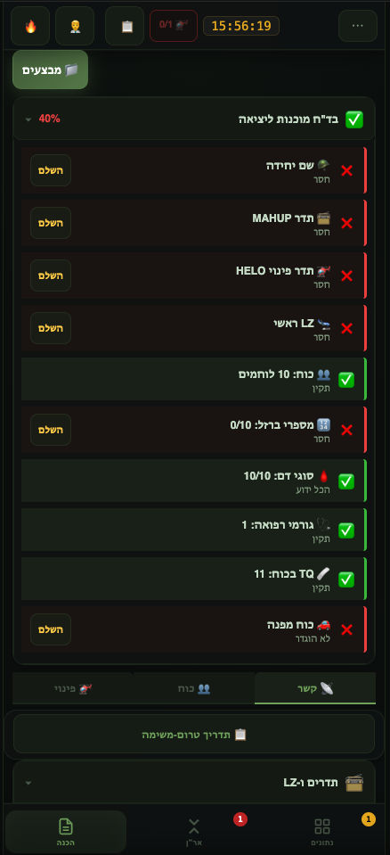</p>
<p align="center"><em>Readiness dashboard: incomplete preparation items are visible before mission start.</em></p>

<table>
  <tr>
    <td align="center"><a href="docs/screenshots/screenshot-02.png">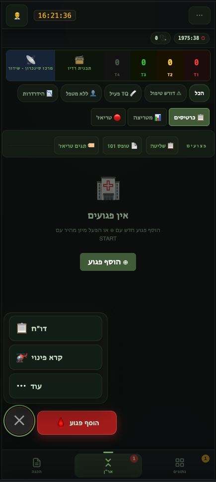</a><br><sub>New casualty entry</sub></td>
    <td align="center"><a href="docs/screenshots/screenshot-03.png">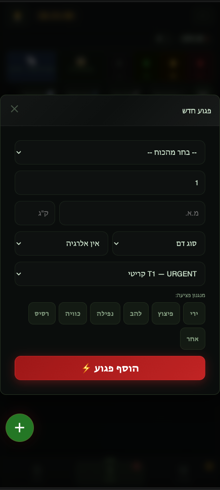</a><br><sub>Assignment and identity</sub></td>
    <td align="center"><a href="docs/screenshots/screenshot-04.png">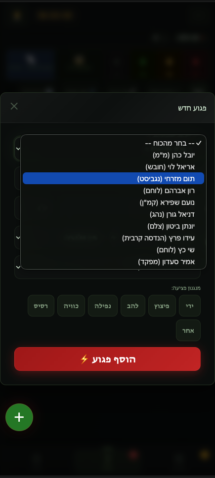</a><br><sub>Priority and mechanism</sub></td>
  </tr>
</table>
</details>

<details>
<summary><strong>02 · Casualty Care and MARCH Treatment</strong> — document care at the point of action</summary>

This is the clinical point-of-care surface: injury mapping, T1–T4 triage, MARCH state, vitals, treatment actions, medication support, and next-action guidance. The interface keeps critical information visible while allowing optional documentation to be completed later.

<table>
  <tr>
    <td align="center"><a href="docs/screenshots/screenshot-05.png">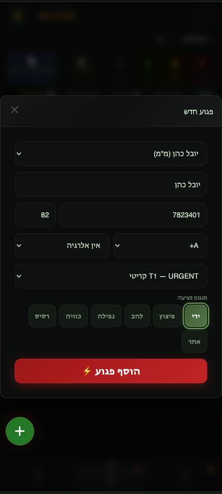</a><br><sub>Injury map and profile</sub></td>
    <td align="center"><a href="docs/screenshots/screenshot-06.png">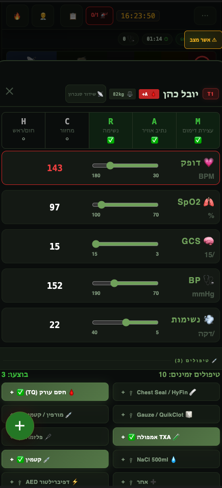</a><br><sub>MARCH and vitals</sub></td>
    <td align="center"><a href="docs/screenshots/screenshot-07.png">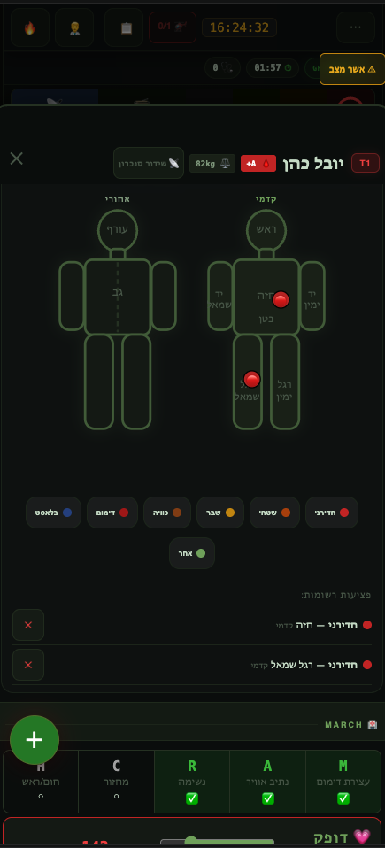</a><br><sub>War Room casualty cards</sub></td>
  </tr>
  <tr>
    <td align="center"><a href="docs/screenshots/screenshot-08.png">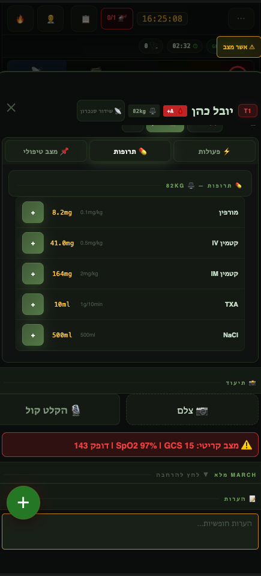</a><br><sub>Treatment record</sub></td>
    <td align="center"><a href="docs/screenshots/screenshot-09.png">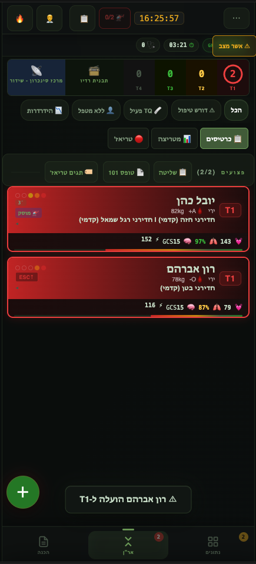</a><br><sub>Medication support</sub></td>
    <td align="center"><a href="docs/screenshots/screenshot-10.png">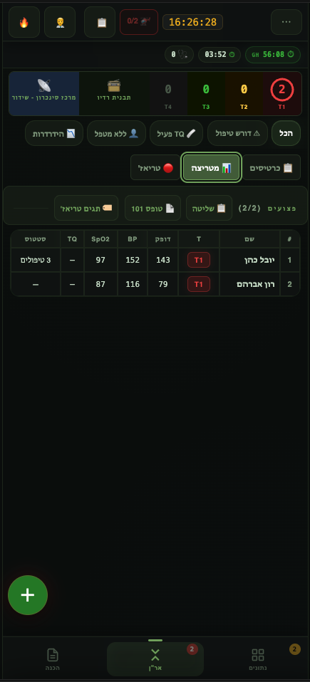</a><br><sub>Triage priorities</sub></td>
  </tr>
  <tr>
    <td align="center"><a href="docs/screenshots/screenshot-11.png">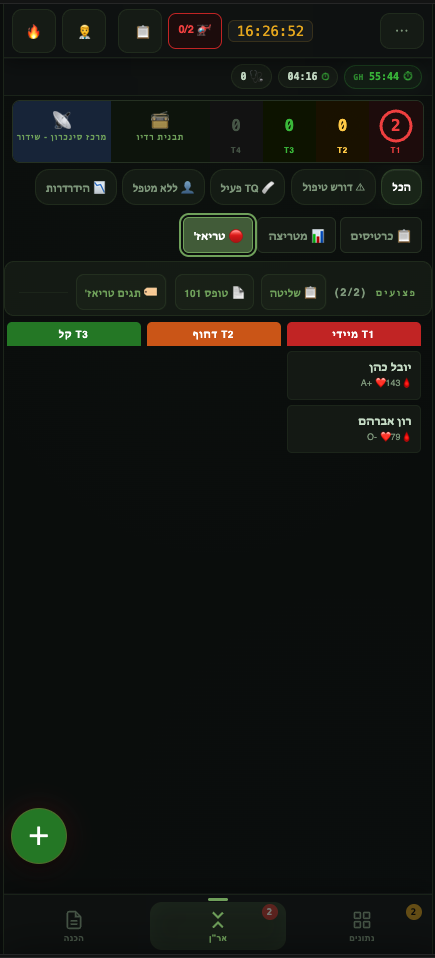</a><br><sub>Blood compatibility</sub></td>
    <td align="center"><a href="docs/screenshots/screenshot-12.png">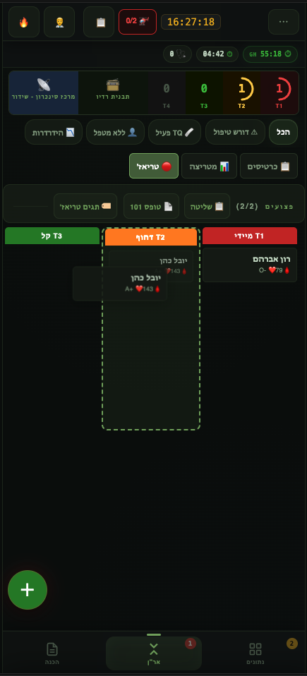</a><br><sub>Clinical checklist</sub></td>
    <td></td>
  </tr>
</table>
</details>

<details>
<summary><strong>03 · Operational Command and Field Coordination</strong> — coordinate people, resources, and evacuation</summary>

This layer turns individual care records into a coordinated operational picture. It supports radio communication, reference lookup, medic allocation, evacuation priority, CASEVAC queue management, and landing-zone coordination.

<table>
  <tr>
    <td align="center"><a href="docs/screenshots/screenshot-13.png">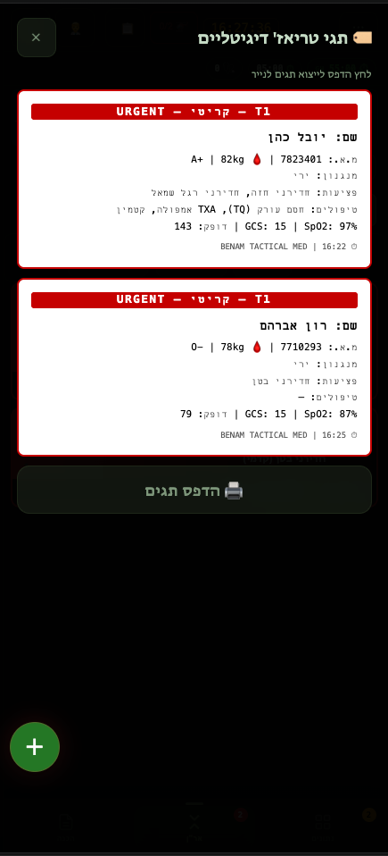</a><br><sub>Operational checklist</sub></td>
    <td align="center"><a href="docs/screenshots/screenshot-14.png">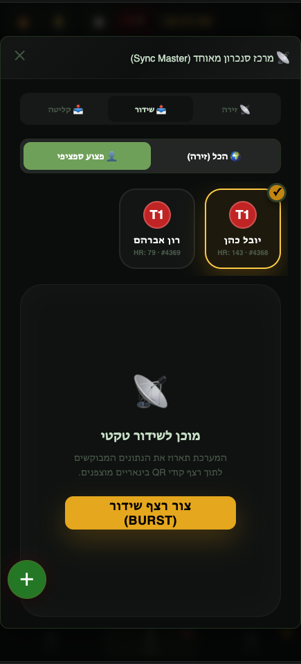</a><br><sub>Radio and communications</sub></td>
    <td align="center"><a href="docs/screenshots/screenshot-15.png">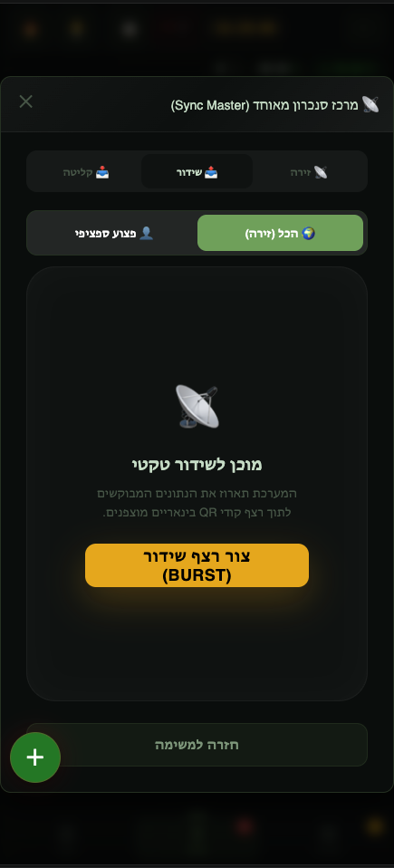</a><br><sub>Reference library</sub></td>
  </tr>
  <tr>
    <td align="center"><a href="docs/screenshots/screenshot-16.png">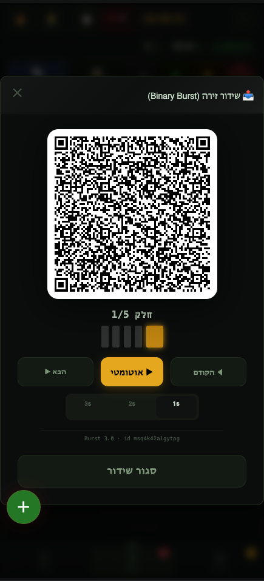</a><br><sub>Next action surface</sub></td>
    <td align="center"><a href="docs/screenshots/screenshot-17.png">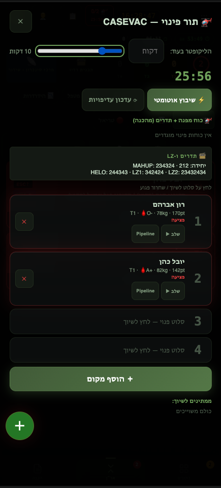</a><br><sub>Evacuation queue</sub></td>
    <td align="center"><a href="docs/screenshots/screenshot-18.png">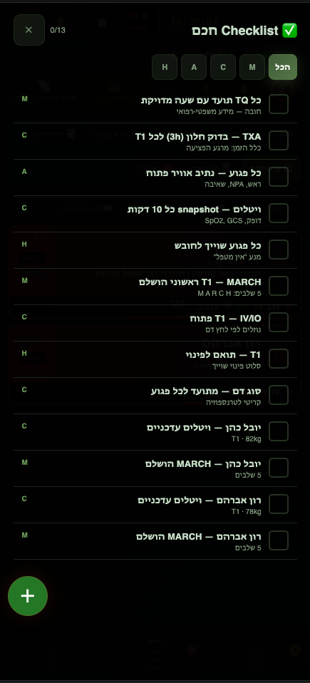</a><br><sub>Priority ordering</sub></td>
  </tr>
  <tr>
    <td align="center"><a href="docs/screenshots/screenshot-19.png">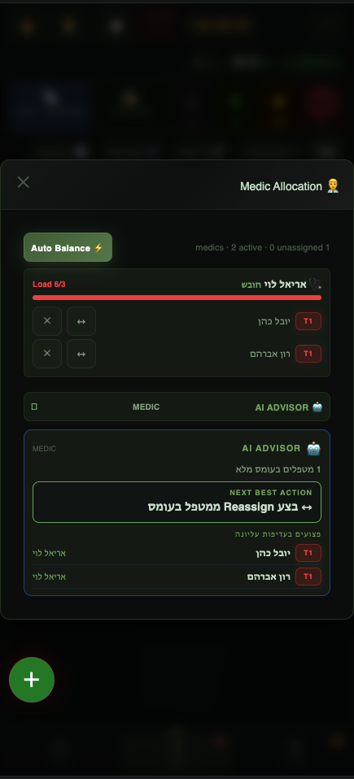</a><br><sub>Medic allocation</sub></td>
    <td align="center"><a href="docs/screenshots/screenshot-20.png">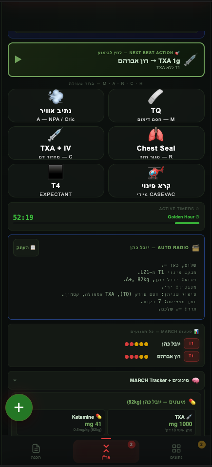</a><br><sub>CASEVAC management</sub></td>
    <td></td>
  </tr>
</table>
</details>

<details>
<summary><strong>04 · Synchronization and Handoff</strong> — transfer validated state without a server</summary>

BENAM can exchange a complete scene or a selected casualty through a human-controlled QR workflow. The receiver previews additions, merges, and rejected records before committing the result locally.

<table>
  <tr>
    <td align="center"><a href="docs/screenshots/screenshot-21.png">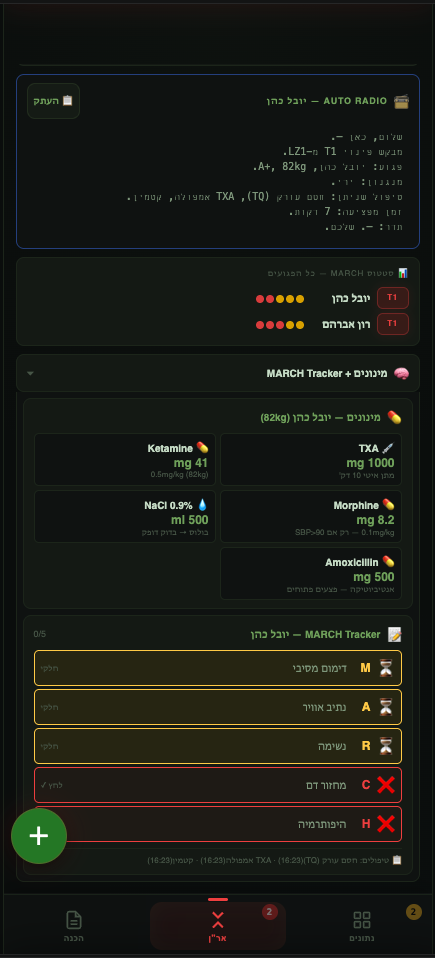</a><br><sub>Blood and handoff context</sub></td>
    <td align="center"><a href="docs/screenshots/screenshot-22.png">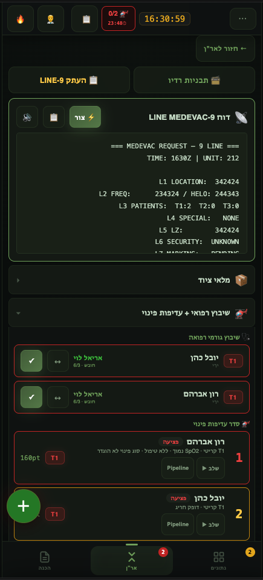</a><br><sub>Sync Master dashboard</sub></td>
    <td align="center"><a href="docs/screenshots/screenshot-23.png">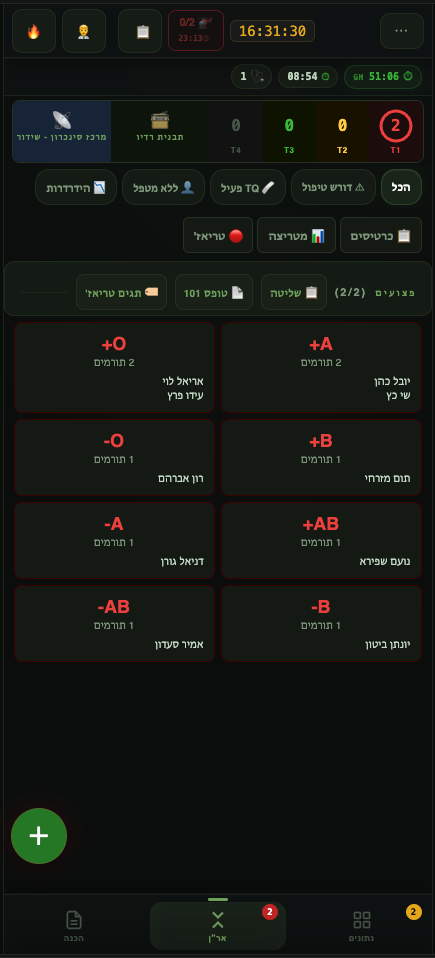</a><br><sub>Binary Burst transmission</sub></td>
  </tr>
  <tr>
    <td align="center"><a href="docs/screenshots/screenshot-24.png">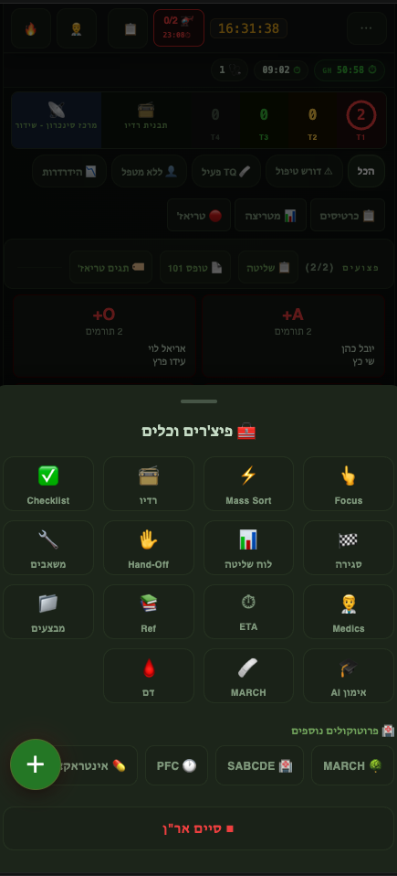</a><br><sub>Scoped patient handoff</sub></td>
    <td></td>
    <td></td>
  </tr>
</table>
</details>

<details>
<summary><strong>05 · Reports, Timeline, Analytics, and Training</strong> — close the loop and learn from the incident</summary>

The final workflow converts field activity into a traceable record. It includes reports, timeline review, AAR/analytics, digital triage output, reference content, protocol views, and repeatable training scenarios.

<table>
  <tr>
    <td align="center"><a href="docs/screenshots/screenshot-25.png">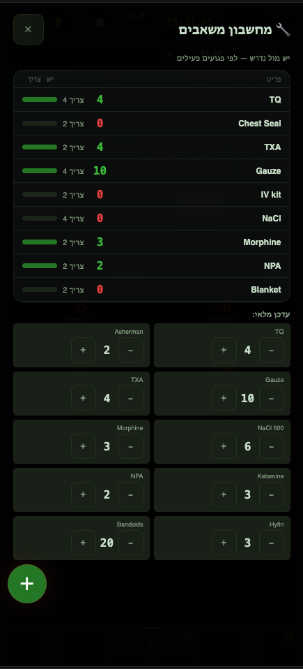</a><br><sub>Incident report</sub></td>
    <td align="center"><a href="docs/screenshots/screenshot-26.png">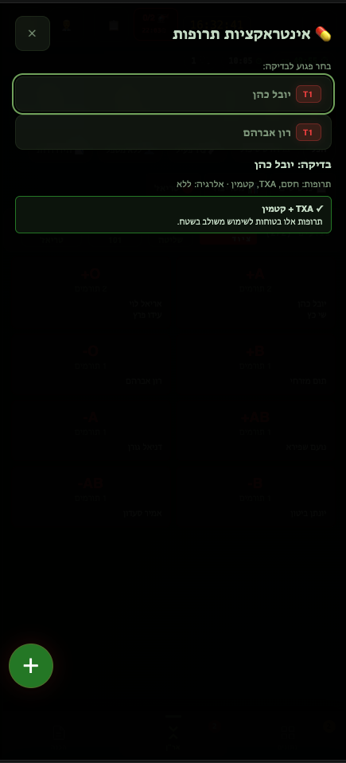</a><br><sub>Timeline and events</sub></td>
    <td align="center"><a href="docs/screenshots/screenshot-27.png">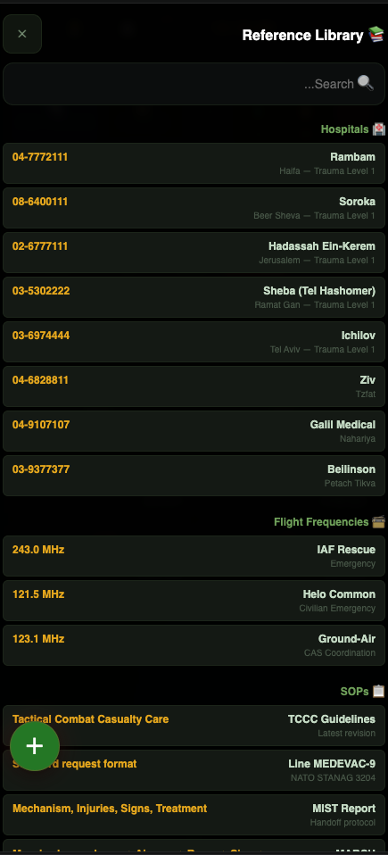</a><br><sub>Training scenarios</sub></td>
  </tr>
  <tr>
    <td align="center"><a href="docs/screenshots/screenshot-28.png">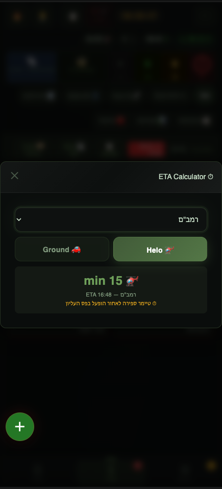</a><br><sub>After-action review</sub></td>
    <td align="center"><a href="docs/screenshots/screenshot-29.png">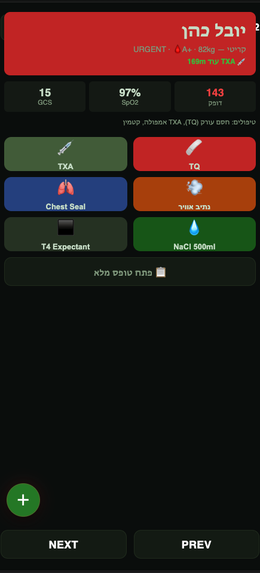</a><br><sub>Clinical references</sub></td>
    <td align="center"><a href="docs/screenshots/screenshot-30.png">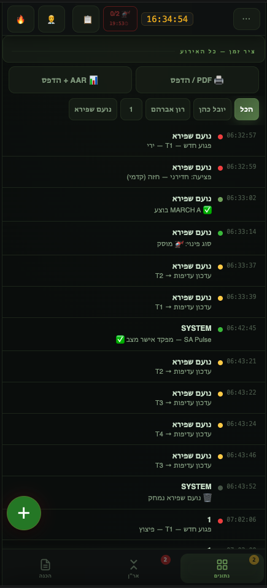</a><br><sub>Medical resources</sub></td>
  </tr>
  <tr>
    <td align="center"><a href="docs/screenshots/screenshot-31.png">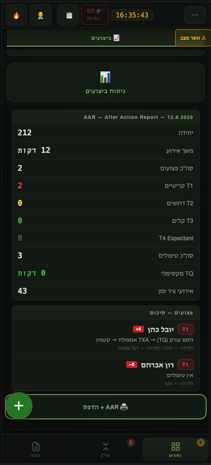</a><br><sub>Digital triage tag</sub></td>
    <td align="center"><a href="docs/screenshots/screenshot-32.png">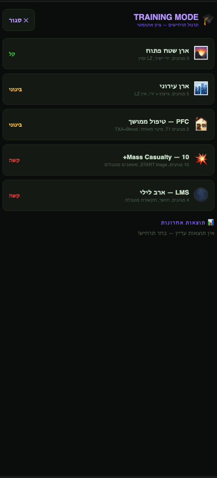</a><br><sub>Training and analytics</sub></td>
    <td></td>
  </tr>
</table>
</details>

---

## Tech Stack

| Layer | Technology | Notes |
|---|---|---|
| **Frontend** | HTML5 + CSS3 + Vanilla JS | No frameworks — fast & portable |
| **TypeScript** | Strict mode, DI Container | Domain services, background tasks |
| **Build** | Vite | HMR, TS compilation, bundling |
| **Offline** | Service Worker (Cache API) | 100% offline-first |
| **Storage** | StorageAdapter over localStorage | Current active path; no backend |
| **Voice** | Web Speech API (he-IL) | Hebrew voice input + audio recording |
| **QR / Sync** | Canvas QR + Mesh chunking | No external libs, inter-device sync |
| **Tests** | Playwright | 115 E2E and integration tests |
| **CI/CD** | GitHub Actions | typecheck → build → E2E |
| **Mobile** | PWA + Android APK | Standalone, RTL, he locale |

---

## Privacy & Security

- ✓ **Zero servers** — data never leaves the device
- ✓ **Zero API calls** — not a single network request
- ✓ **Zero telemetry** — no tracking, analytics, or external logs

---

## Contributing

### Contribution Workflow

```bash
# 1. Fork + Clone
git clone https://github.com/YOUR_USERNAME/BENAM---Tactical-Preview.git

# 2. New branch
git checkout -b feature/my-feature

# 3. Test before commit
npm test

# 4. Push + Pull Request
git push origin feature/my-feature
```

**Key Rules:**
- **RULE 01**: Every new feature must work 100% offline.
- **RULE 02**: UI must be RTL, Hebrew-compatible, and touch-friendly.
- **RULE 03**: No new external dependencies without prior discussion.

---

## About
**BENAM**  
*Built for the field. Works without the cloud.*  
ISC License © Yuvalalex

- [Report a bug](https://github.com/Yuvalalex/BENAM---Tactical-Preview/issues)
- [Presentation deck](https://docs.google.com/presentation/d/1dOmADFgqdxe--yQ07pob6icAYKNHVX6_DnLUm9n2ZiU/edit?usp=sharing)
