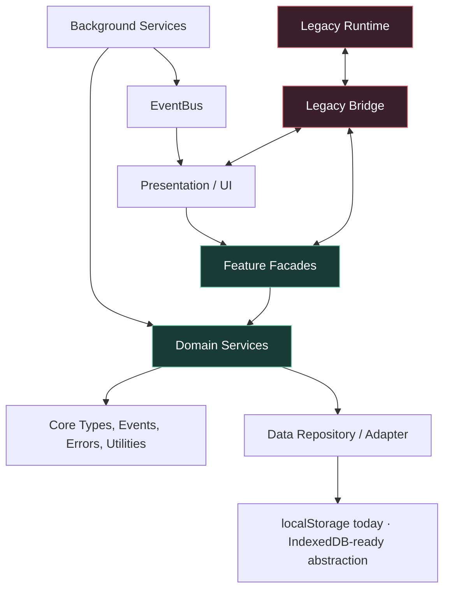
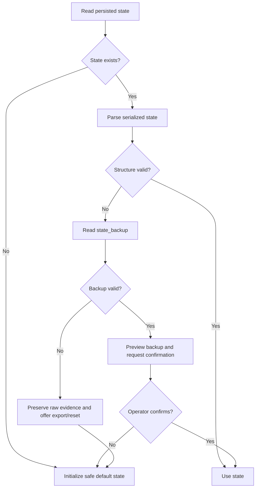
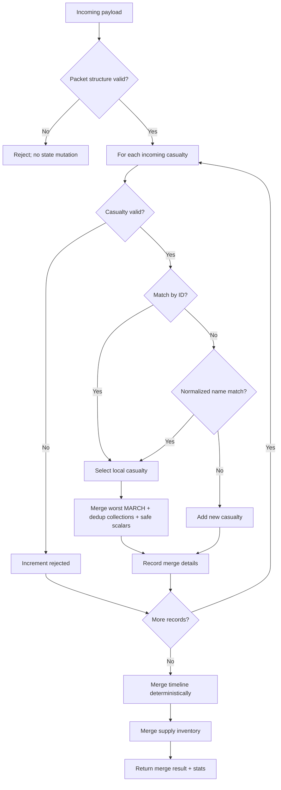
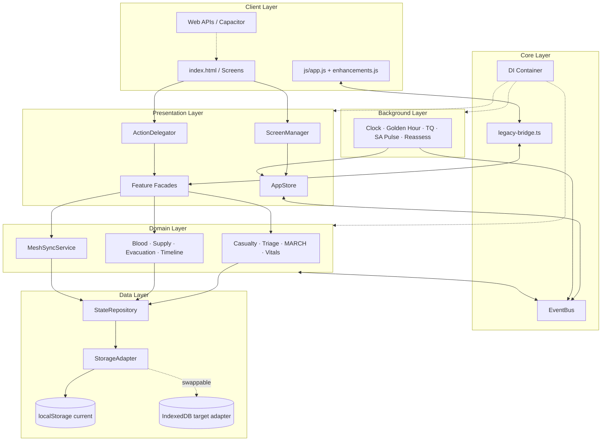
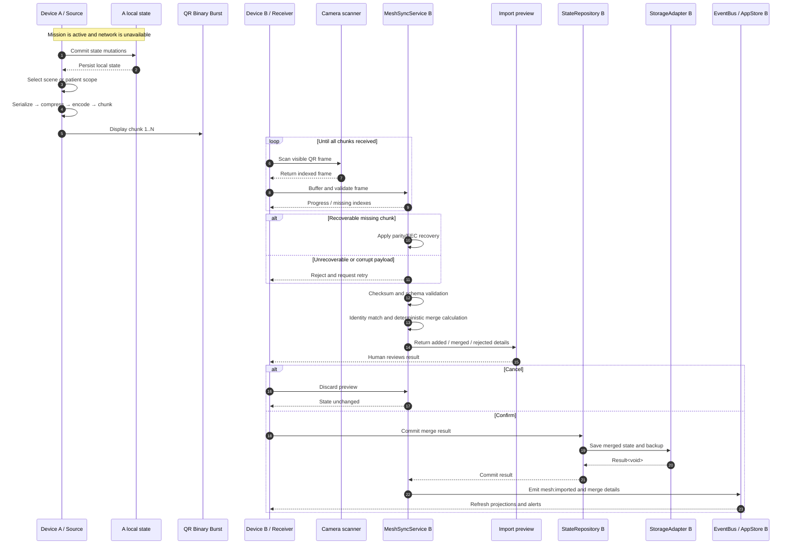
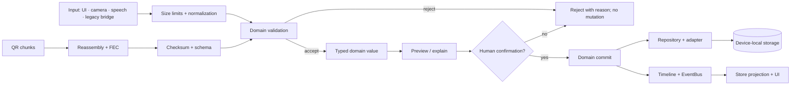
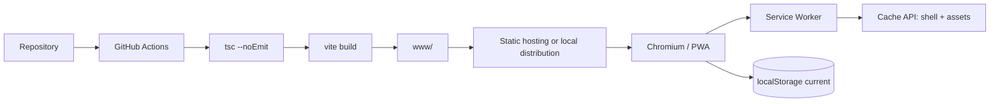
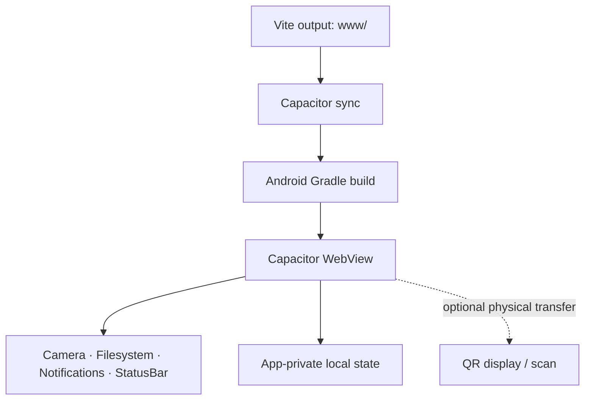

# BENAM Tactical Preview — Deep-Dive Technical Architecture

**Version:** 1.1.0
**Classification:** Engineering Reference
**Status:** Current implementation reference and migration contract
**Last updated:** 2026-08-12
**Audience:** BENAM engineers, reviewers, QA, security reviewers, clinical protocol owners, and autonomous implementation agents

> This document describes how BENAM is built today, the boundaries that must be preserved during development, and the migration direction for the hybrid runtime. It is complementary to [`PRD.md`](../PRD.md): the PRD defines product behavior and delivery requirements; this document defines technical structure, ownership, runtime interactions, persistence, synchronization, security, and build behavior.

## Table of Contents

1. [System Overview](#1-system-overview)
2. [Repository Structure](#2-repository-structure)
3. [Runtime and Bootstrap](#3-runtime-and-bootstrap)
4. [Layered Architecture](#4-layered-architecture)
5. [Dependency Injection](#5-dependency-injection)
6. [EventBus and Module Communication](#6-eventbus-and-module-communication)
7. [State Management](#7-state-management)
8. [Data Persistence and Recovery](#8-data-persistence-and-recovery)
9. [Domain Services](#9-domain-services)
10. [Feature Facades](#10-feature-facades)
11. [Presentation and Legacy Bridge](#11-presentation-and-legacy-bridge)
12. [Background Services](#12-background-services)
13. [QR and Mesh Synchronization](#13-qr-and-mesh-synchronization)
14. [Data Flow Diagrams](#14-data-flow-diagrams)
15. [Error Handling](#15-error-handling)
16. [Security Architecture](#16-security-architecture)
17. [Offline and Deployment Architecture](#17-offline-and-deployment-architecture)
18. [Build and Toolchain](#18-build-and-toolchain)
19. [Testing Strategy](#19-testing-strategy)
20. [Migration and Evolution Rules](#20-migration-and-evolution-rules)
21. [Operational Constraints](#21-operational-constraints)
22. [Architecture Decision Log](#22-architecture-decision-log)

---

## 1. System Overview

BENAM is an offline-first single-page application for tactical medical incident management. It runs as a browser PWA and as an Android application packaged with Capacitor. The core workflow does not require a server, account, live network, cloud database, or third-party runtime API.

The current codebase is a **hybrid architecture**:

- A mature vanilla JavaScript runtime under `js/` owns much of the existing DOM behavior and the legacy global state object `window.S`.
- A structured TypeScript runtime under `src/` introduces dependency injection, typed events, domain services, feature facades, persistence abstractions, and background services.
- `src/legacy-bridge.ts` connects the two runtimes during incremental migration.
- Vite loads and builds the TypeScript entry point while copying the legacy runtime and static assets into `www/`.

```text
┌──────────────────────────────────────────────────────────────────────┐
│                         BENAM DEVICE RUNTIME                         │
│                                                                      │
│  ┌───────────────────────┐       ┌────────────────────────────────┐  │
│  │ index.html / PWA shell│       │  Capacitor Android WebView     │  │
│  │ RTL screens and forms │       │ Camera · Filesystem · Haptics  │  │
│  └───────────┬───────────┘       └───────────────┬────────────────┘  │
│              │                                   │                   │
│              ├───────────────┬───────────────────┘                   │
│              │               │                                       │
│  ┌───────────▼───────┐  ┌────▼───────────────────────────────────┐   │
│  │ Legacy JS runtime │◄►│ TypeScript runtime                     │   │
│  │ js/app.js         │  │ src/main.ts                            │   │
│  │ enhancements.js   │  │ DI · EventBus · Domain · Features      │   │
│  │ parts/01–41       │  │ Presentation · Background              │   │
│  └───────────┬───────┘  └───────────────────┬────────────────────┘   │
│              │                              │                        │
│              └──────────────┬───────────────┘                        │
│                             ▼                                        │
│                   ┌──────────────────────┐                           │
│                   │ window.S / AppStore  │                           │
│                   │ local state contract │                           │
│                   └──────────┬───────────┘                           │
│                              ▼                                       │
│                   ┌──────────────────────┐                           │
│                   │ StorageAdapter       │                           │
│                   │ localStorage today   │                           │
│                   │ IndexedDB-ready API  │                           │
│                   └──────────────────────┘                           │
└──────────────────────────────────────────────────────────────────────┘

             Explicit physical exchange only
             ┌──────────────┐       ┌──────────────┐
             │ Device A     │ ─QR─► │ Device B     │
             │ export       │       │ validate     │
             └──────────────┘       │ preview      │
                                    │ confirm      │
                                    │ merge        │
                                    └──────────────┘
```

### 1.1 Architectural goals

1. Keep the critical workflow fully operational without connectivity.
2. Isolate clinical and operational rules from the DOM and platform APIs.
3. Make state mutations observable, testable, timestamped, and recoverable.
4. Allow the legacy runtime to continue operating while TypeScript ownership expands.
5. Make device-to-device exchange explicit, validated, reviewable, and deterministic.
6. Fail locally and visibly rather than silently losing or inventing data.
7. Keep native capabilities optional for the core workflow.

### 1.2 Architectural non-goals

- A cloud-first or server-dependent application.
- Silent background synchronization over a network.
- Autonomous diagnosis or treatment prescription.
- A second, competing business-logic implementation in the TypeScript layer.
- A direct rewrite of the entire legacy runtime without parity tests.

### 1.3 Source-of-truth statement

During the migration, `window.S` remains the operational state source of truth for compatibility with the legacy runtime. `AppStore` is a reactive typed wrapper and projection boundary; it MUST NOT become a second unsynchronized state store. New business rules MUST be implemented in typed domain services and invoked through feature facades.

---

## 2. Repository Structure

```text
BENAM---Tactical-Preview/
├── index.html                 # SPA shell; RTL screens and legacy handlers
├── manifest.json              # PWA metadata, icons, standalone display
├── sw.js                      # Service Worker and cache strategy
├── vite.config.ts             # Vite build and legacy asset plugins
├── tsconfig.json              # Strict TypeScript configuration
├── capacitor.config.json      # Android/WebView/native capability config
├── package.json               # Scripts and dependencies
│
├── js/                        # Legacy vanilla JavaScript runtime
│   ├── app.js                 # Generated concatenation of app parts
│   ├── enhancements.js        # Generated enhancement runtime
│   ├── parts/                  # Numbered source modules, 01–41
│   └── vendor/                 # Vendored browser libraries/assets
│
├── src/                       # Typed architecture under migration
│   ├── main.ts                 # Composition root and bootstrap
│   ├── main.js                 # Legacy-compatible entry shim
│   ├── legacy-bridge.ts        # TS ↔ legacy compatibility boundary
│   ├── core/                   # DI, events, types, errors, constants, utils
│   ├── domain/                 # Pure business services and merge rules
│   ├── data/                   # Storage adapters and repository
│   ├── features/               # Use-case orchestration facades
│   ├── presentation/           # Store, screen manager, action routing
│   ├── background/             # Timers, monitors, alerts, refresh services
│   ├── components/             # Hybrid UI components
│   ├── services/               # Hybrid service implementations
│   ├── constants/              # Legacy/domain constants
│   ├── styles/                 # CSS and theme layers
│   └── utils/                  # Shared formatting and DOM utilities
│
├── tests/                      # Playwright E2E and integration suites
├── scripts/                    # Concatenation, CSS split, export tools
├── android/                    # Capacitor Android project
├── icons/                      # PWA and Android icon assets
├── www/                        # Vite/Capacitor build output
├── docs/                       # Engineering documentation
│   ├── PRD.md                  # Product requirements source of truth
│   └── ARCHITECTURE.md         # This technical architecture reference
└── .github/workflows/          # CI automation
```

### 2.1 Generated files

`js/app.js` and `js/enhancements.js` are generated by the `concat-parts` Vite plugin from `js/parts/*.js`. Engineers MUST edit the numbered source parts rather than manually editing generated concatenations unless performing a deliberate emergency recovery. Generated changes MUST be reviewed for unintended ordering changes.

### 2.2 Directory ownership

| Directory | Ownership | Boundary |
| --- | --- | --- |
| `src/core` | Platform-independent primitives | No DOM or feature-specific behavior |
| `src/domain` | Business and clinical workflow rules | No DOM, storage globals, or network |
| `src/data` | Serialization and persistence | No UI or clinical decisions |
| `src/features` | Use-case orchestration | Coordinates services; does not duplicate rules |
| `src/presentation` | UI coordination | No persistence implementation or clinical scoring |
| `src/background` | Time and alert monitoring | Emits signals; domain owns mutation |
| `js/parts` | Legacy behavior during migration | Must remain compatible until replaced |
| `tests` | Verification | No real patient or operational data |

---

## 3. Runtime and Bootstrap

### 3.1 Loading sequence

```text
Browser / WebView loads index.html
        ↓
Legacy vendor scripts and generated JS load
        ↓
Legacy runtime initializes window.S and global handlers
        ↓
Vite module loads src/main.ts
        ↓
initBridge()
        ↓
registerCore()
registerDataLayer()
registerDomainServices()
registerPresentation()
registerFeatureModules()
registerBackgroundServices()
        ↓
Expose typed services to compatibility bridge
        ↓
ScreenManager.init()
ActionDelegator.init()
AppStore.startSyncPolling()
        ↓
Report whether legacy state source is ready
```

### 3.2 Composition root

`src/main.ts` is the composition root. It is responsible for wiring dependencies, not for implementing clinical logic. The registration order is intentional:

1. `EventBus` is created first because other services depend on it.
2. Storage adapter and repository are created next.
3. Domain services are registered as singletons.
4. Presentation services receive the shared event bus.
5. Feature modules and background services are registered.
6. Services are exposed through the legacy bridge.
7. Presentation is initialized and synchronization polling starts.

### 3.3 Bootstrap failure policy

If an individual optional capability fails, the application MUST preserve the core UI and expose a degraded state. If composition fails before a usable state repository or core domain service exists, the application MUST show a recoverable startup error and MUST NOT claim that mission data is saved.

---

## 4. Layered Architecture

BENAM follows a pragmatic Clean Architecture model adapted for a hybrid browser application.



### 4.1 Dependency direction

Allowed dependency direction:

```text
Presentation → Features → Domain → Core
                       ↘ Data abstractions
Background → Domain / EventBus
Legacy ↔ Legacy Bridge ↔ typed services
```

The following are prohibited:

- Domain services importing DOM APIs.
- Domain services reading `window.S` directly.
- Data adapters deciding triage, treatment, or evacuation priority.
- UI handlers writing raw storage keys directly.
- Background services silently changing clinical state.
- New feature logic being added only to `window` globals.

### 4.2 Core layer

`src/core/` contains framework-agnostic primitives:

- `di/`: container and dependency tokens.
- `events/`: typed event map and publish/subscribe implementation.
- `errors/`: `Result`, `AppError`, error codes, severity, and retry policy.
- `types/`: casualty, mission, equipment, AI signal, and enum definitions.
- `utils/`: IDs, time handling, and validation.
- `constants/`: triage values, priority ordering, and domain constants.

The core layer MUST remain usable in tests without a browser DOM wherever practical.

### 4.3 Domain layer

`src/domain/services/` contains the business rules. Services should be deterministic, side-effect controlled, and independently testable. They receive values and return values or typed results; orchestration layers decide when to persist and how to present outcomes.

### 4.4 Data layer

`src/data/` defines persistence interfaces and repositories. The current implementation uses `LocalStorageAdapter`; the adapter contract is intentionally independent of the backing store so an IndexedDB implementation can be introduced without changing domain callers.

### 4.5 Feature layer

`src/features/` coordinates user-facing use cases. A facade may call several domain services, append a timeline event, persist the result, and return a view-ready outcome. It MUST NOT reimplement domain rules that belong in a domain service.

### 4.6 Presentation layer

`src/presentation/` coordinates the UI through `AppStore`, `ScreenManager`, and `ActionDelegator`. It maps user actions and state changes to screens and does not own the canonical business state.

### 4.7 Background layer

`src/background/` owns periodic services. A background service reads current state, evaluates a time or monitoring rule, and emits typed events. It MUST recompute from timestamps after suspension or resume rather than trusting the number of browser ticks received.

---

## 5. Dependency Injection

The DI container is a lightweight homegrown IoC container. Services are registered under tokens and resolved by type at composition time.

```typescript
container.registerSingleton(DI_TOKENS.EventBus, () => new EventBus());
container.registerSingleton(
  DI_TOKENS.TriageService,
  () => new TriageService(),
);

const triage = container.resolve<TriageService>(DI_TOKENS.TriageService);
```

### 5.1 Registration groups

| Group | Examples |
| --- | --- |
| Infrastructure | `EventBus`, `StorageAdapter`, `StateRepository` |
| Domain | `CasualtyService`, `TriageService`, `MarchService`, `VitalsService`, `BloodService`, `EvacuationService`, `SupplyService`, `TimelineService`, `MeshSyncService` |
| Features | `CasualtyFacade`, `TriageFacade`, `EvacuationFacade`, `CommsSyncFacade` |
| Presentation | `AppStore`, `ScreenManager`, `ActionDelegator` |
| Background | `BackgroundServiceManager` and registered monitor services |

### 5.2 DI rules

- Tokens MUST be defined centrally in `src/core/di/tokens.ts`.
- Production code MUST resolve services through tokens rather than constructing infrastructure ad hoc.
- Singletons are appropriate for stateful process-wide services; pure services MAY be transient where useful in tests.
- Tests SHOULD inject fakes for storage, event emission, clocks, and platform adapters.
- A service MUST NOT resolve an unrelated service deep inside a method when constructor injection makes the dependency explicit.

---

## 6. EventBus and Module Communication

`EventBus` implements typed publish/subscribe communication. It reduces direct coupling between domain, background, presentation, and compatibility modules.

```typescript
eventBus.emit('casualty:triage-changed', {
  id: casualtyId,
  from: TriagePriority.T2,
  to: TriagePriority.T1,
});

const unsubscribe = eventBus.on(
  'casualty:triage-changed',
  ({ id, from, to }) => {
    // Project or react to the event without owning the mutation.
  },
);
```

### 6.1 Event categories

| Category | Examples |
| --- | --- |
| Casualty lifecycle | `casualty:added`, `casualty:updated`, `casualty:removed`, `casualty:triage-changed`, `casualty:escalated` |
| Treatment | `treatment:applied`, `treatment:tq-started`, `treatment:vitals-recorded` |
| Mission | `mission:started`, `mission:ended`, `mission:mode-changed` |
| Sync | `mesh:exported`, `mesh:imported`, `qr:scan-complete` |
| Supply | `supply:used`, `supply:low` |
| UI/navigation | `screen:changed`, `drawer:opened`, `drawer:closed` |
| Alerts | `alert:ai-advisor`, `alert:golden-hour`, `alert:golden-hour-half`, `alert:tq-warning` |
| Persistence | `state:saved`, storage failure events, recovery events |

### 6.2 Event rules

1. Event names are contracts and MUST be updated with their payload types.
2. Events describe facts or requests; they MUST NOT contain mutable object references that subscribers can alter.
3. Subscriptions MUST be released when their owning service or screen is destroyed.
4. Events containing sensitive content MUST be minimized; names, notes, photos, and full payloads MUST NOT be logged.
5. A failed persistence operation MUST emit or return an error state that the UI can display.

---

## 7. State Management

### 7.1 AppStore

`AppStore` is a reactive wrapper over the legacy state contract. It provides typed access, dispatch/update behavior, subscription, and synchronization polling. It does not eliminate the legacy state source during the migration.

```text
AppStore.dispatch(updater)
    │
    ├─► Read current state projection
    ├─► updater(currentState) → validated patch
    ├─► Apply patch through the compatibility state boundary
    ├─► Persist committed state
    ├─► Snapshot state for change detection
    ├─► Notify subscribers
    └─► Emit state:saved or a typed persistence failure
```

`startSyncPolling()` detects mutations made by legacy code and updates subscribers. Polling is a migration mechanism and SHOULD be removed or narrowed as legacy ownership decreases.

### 7.2 Legacy state shape

The legacy state is intentionally open because the existing runtime contains additional fields. The following fields are the stable cross-layer contract:

```typescript
interface LegacyStateShape {
  force?: unknown[];
  casualties?: unknown[];
  timeline?: unknown[];
  comms?: Record<string, unknown>;
  supplies?: Record<string, number>;
  role?: string | null;
  opMode?: string | null;
  missionType?: string | null;
  missionStart?: number | null;
  missionActive?: boolean;
  fireMode?: boolean;
  commsLog?: unknown[];
  lzStatus?: Record<string, unknown>;
  medicAssignment?: Record<string, string>;
  meshReceived?: unknown[];
  [key: string]: unknown;
}
```

### 7.3 State mutation rules

- Every mutation MUST validate the affected entity before commit.
- Clinical and operational mutations SHOULD append a timeline event.
- A failed write MUST NOT be presented as saved.
- Retried user actions MUST be idempotent where possible.
- State snapshots used for comparison MUST be bounded and must not leak sensitive data to logs.
- State migration MUST preserve unknown clinical fields or fail loudly with a migration result.

---

## 8. Data Persistence and Recovery

### 8.1 Current implementation truth

The current `StorageAdapter` implementation is `LocalStorageAdapter`, using JSON serialization and the `benam_` key prefix. `StateRepository` reads and writes the logical `state` key and also supports a `state_backup` key. The adapter interface is deliberately replaceable; the local repository code should not claim IndexedDB behavior unless an IndexedDB adapter is actually registered.

```text
StateRepository
      │
      ▼
StorageAdapter interface
      │
      └── LocalStorageAdapter (current)
              │
              └── localStorage: benam_state, benam_state_backup, ...

Future compatible implementation:
StorageAdapter interface
      │
      └── IndexedDBAdapter (target, requires migration and device testing)
```

### 8.2 Storage adapter contract

```typescript
interface StorageAdapter {
  get<T>(key: string): Result<T | null>;
  set<T>(key: string, value: T): Result<void>;
  remove(key: string): Result<void>;
  clear(): Result<void>;
  has(key: string): boolean;
  keys(): string[];
}
```

The adapter MUST translate platform exceptions into typed `AppError` values. It MUST identify quota failures separately from generic read/write failures.

### 8.3 Repository responsibilities

`StateRepository` owns:

- Full state save/load.
- Existence checks.
- Clearing BENAM-prefixed state.
- Incremental casualty saves where supported.
- Backup creation with `_backupAt` timestamp.
- Backup loading.
- Basic structural validation before returning saved data.

It MUST NOT own triage, treatment, evacuation, or merge policy.

### 8.4 Recovery sequence



### 8.5 Persistence migration requirements

An IndexedDB adapter MAY replace `LocalStorageAdapter` only when:

1. The same logical repository contract passes all existing tests.
2. A versioned migration exists for current `benam_` keys.
3. Export and restore work before and after migration.
4. Quota, private browsing, WebView, reload, and process-kill cases are tested.
5. The active adapter is visible in diagnostics.
6. Rollback to the prior adapter does not silently delete data.

---

## 9. Domain Services

### 9.1 CasualtyService

Owns casualty creation, validation, update, and removal semantics. It ensures stable identifiers and normalized defaults. It MUST NOT render the casualty drawer or decide screen navigation.

### 9.2 TriageService

Owns T1–T4 classification validation, priority ordering, and related transitions. Priority changes MUST be explicit and auditable.

### 9.3 MarchService

Owns MARCH category state and protocol-step evaluation. It MUST expose status in a form suitable for UI and advisor rules while leaving final clinical judgment to the authorized operator.

### 9.4 VitalsService

Owns current vitals validation, history entries, trend calculations, and timestamps. It MUST preserve raw entered values when a field is valid and MUST reject unsupported values rather than silently coercing them.

### 9.5 BloodService

Owns blood compatibility and inventory-facing blood rules. Incompatibility MUST be visible and either blocked or explicitly overridden according to deployment policy.

### 9.6 SupplyService

Owns inventory reads and adjustments. Supply changes SHOULD create timeline or inventory events with item, quantity, source, and time.

### 9.7 EvacuationService

Owns evacuation scoring, reasons, pipeline stages, capacity, assignments, and ordering. Manual overrides MUST be represented as overrides and MUST not be confused with algorithm output.

### 9.8 TimelineService

Owns chronological event creation, deterministic ordering, filtering, and rendering-ready projections. Event records should contain event time and source/device context where available.

### 9.9 MeshSyncService

Owns payload validation, casualty identity matching, merge behavior, duplicate handling, and merge reporting. It MUST remain deterministic and side-effect free until the caller commits the returned merge result.

Current merge behavior includes:

- Match by stable ID first.
- Fall back to normalized name matching when no ID match exists.
- Merge MARCH using worst-of semantics.
- Deduplicate injuries and treatments using deterministic keys.
- Merge notes without repeating existing content.
- Prefer newer TQ timestamps and larger fluid totals according to the service rules.
- Return added, merged, rejected counts and per-casualty detail.

---

## 10. Feature Facades

Feature facades are use-case boundaries between presentation and domain services.

| Facade | Responsibility |
| --- | --- |
| `CasualtyFacade` | Create, edit, select, remove, and project casualty state |
| `TriageFacade` | Sort, classify, display, and escalate triage state |
| `EvacuationFacade` | Manage evacuation stages, assignments, score explanations, and report generation |
| `CommsSyncFacade` | Coordinate export/import UI, QR workflow, validation, preview, and commit |

A facade MAY coordinate multiple services. Example:

```text
Operator action
   ↓
CommsSyncFacade
   ├─ MeshSyncService.validate()
   ├─ MeshSyncService.merge()
   ├─ StateRepository.save()
   ├─ TimelineService.append()
   └─ EventBus.emit('mesh:imported')
```

Facades MUST return a result that lets the presentation layer distinguish:

- successful committed mutation;
- valid preview awaiting confirmation;
- rejected input;
- persistence failure;
- unsupported capability;
- recoverable retry state.

---

## 11. Presentation and Legacy Bridge

### 11.1 ScreenManager

`ScreenManager` owns screen activation and navigation coordination. It MUST keep navigation state separate from domain state and MUST prevent a screen transition from implying that a save succeeded.

Current screen identifiers include:

| ID | Purpose |
| --- | --- |
| `sc-role` | Role and mission setup |
| `sc-prep` | Pre-mission preparation |
| `sc-war` | War Room aggregate view |
| `sc-fire` | Fire Mode |
| `sc-cas` | Casualty detail |
| `sc-blood` | Blood bank and compatibility |
| `sc-report` | Evacuation and report |
| `sc-stats` | Statistics and AAR |
| `sc-timeline` | Full timeline |

### 11.2 ActionDelegator

The intended direction is to replace inline `onclick` handlers with `data-action` attributes and centralized dispatch.

```html
<!-- Transitional legacy form -->
<button onclick="startMission()">Start</button>

<!-- Target form -->
<button data-action="startMission">Start</button>
```

```typescript
delegator.register('startMission', async (_event, element) => {
  await missionFacade.start(element.dataset);
});
```

Click handling contract:

```text
document click, capture phase
        ↓
walk upward from event.target
        ↓
find closest [data-action]
        ↓
lookup typed handler
        ↓
execute handler
        ↓
no handler → no-op and preserve normal propagation
```

Until migration is complete, inline legacy handlers remain supported. New screens SHOULD use `data-action` and the typed delegator.

### 11.3 Legacy bridge

The bridge exposes typed services and compatibility objects through controlled registration. It currently supports services including:

```text
eventBus
casualty
triage
march
blood
vitals
evacuation
supply
timeline
meshSync
store
screen
actions
modules.casualty
modules.triage
modules.evacuation
modules.commsSync
backgroundManager
```

The bridge MUST be treated as a temporary boundary. A bridge export requires:

- documented owner;
- typed interface;
- no hidden mutation outside the owning service;
- migration or removal issue;
- test coverage for legacy and typed callers.

---

## 12. Background Services

All background services implement the `BackgroundService` contract and are registered by `registerBackgroundServices(container)`.

```typescript
interface BackgroundService {
  readonly name: string;
  readonly intervalMs: number;
  readonly lifecycle: 'always' | 'mission' | 'active';
  tick(): void;
}
```

### 12.1 Registered services

| Service | Function | Current interval / lifecycle |
| --- | --- | --- |
| `ClockService` | Mission elapsed-time updates | 1 second / always |
| `GoldenHourService` | Golden Hour threshold signals | service-defined / mission |
| `ReassessService` | Reassessment reminders | service-defined / mission |
| `TQMonitorService` | Tourniquet elapsed time and warning | 1 second / always |
| `HeliCountdownService` | Evacuation/heli countdown | service-defined / mission |
| `SAPulseService` | Situational-awareness advisor evaluation | service-defined / mission |
| `AutoEscalationService` | Escalation checks | service-defined / mission |
| `StatsRefreshService` | Statistics refresh events | service-defined / active |
| `MapRefreshService` | Force/map projection refresh | service-defined / active |

### 12.2 Lifecycle requirements

- Registration occurs during bootstrap.
- Services MUST be started and stopped through `BackgroundServiceManager`.
- Mission-scoped services MUST not continue operating after mission close.
- Service callbacks MUST be bounded and must not accumulate listeners on repeated start/stop.
- A removed casualty MUST clean up per-casualty timer state.
- Time alerts MUST use wall-clock timestamps and recompute after resume.
- Alert cooldowns MUST prevent notification storms without suppressing the underlying timeline record.

### 12.3 TQ monitor behavior

`TQMonitorService` evaluates every casualty with a `tqStart` timestamp, emits elapsed seconds, and emits a throttled warning after the configured critical threshold. Removal events clear the casualty's cooldown state to prevent memory growth.

### 12.4 Clinical safety boundary

Background services may emit warnings and reminders. They MUST NOT autonomously apply treatment, change triage, assign evacuation, or delete data. All automated advice MUST identify its rule, severity, patient, time, and protocol version where available.

---

## 13. QR and Mesh Synchronization

### 13.1 Exchange model

BENAM exchanges state physically through QR/Binary Burst. The transport is intentionally explicit and operator-mediated.

```text
Device A
  │
  ├─ select all-scene or patient scope
  ├─ build payload
  ├─ validate and serialize
  ├─ compress and encode
  ├─ split into indexed chunks
  └─ display chunks sequentially
          │ physical optical transfer
          ▼
Device B
  ├─ scan chunks
  ├─ validate frame and checksum
  ├─ buffer out-of-order chunks
  ├─ recover one missing chunk when parity allows
  ├─ decompress and validate schema
  ├─ calculate merge preview
  ├─ human confirms
  ├─ persist merged state
  └─ emit imported/merge events
```

### 13.2 Payload requirements

A payload MUST include:

- packet kind (`STATE` or `MESH`);
- schema version;
- export timestamp;
- scope;
- casualties and any permitted timeline/supply data;
- chunk index and total count;
- integrity checksum;
- parity/FEC metadata when used.

Payloads MUST be bounded by chunk count, decoded byte size, nesting depth, string length, and record count before decompression or merge.

### 13.3 Merge algorithm contract



The merge result MUST be a value object containing:

- merged casualties;
- merged timeline;
- merged supplies;
- per-record merge log;
- total incoming, added, merged, and rejected counts.

### 13.4 Synchronization safety rules

- Import preview precedes mutation.
- Corrupt checksum means reject, not partial import.
- Unsupported schema means reject or use a tested migration.
- Replayed payloads MUST be idempotent.
- Same-name/different-ID matches MUST be surfaced as an ambiguity when policy cannot prove identity.
- Imported notes and free text MUST be marked with provenance where merged.
- Merge errors MUST preserve the pre-import local state.

---

## 14. Data Flow Diagrams

### 14.1 Component architecture



### 14.2 Offline-to-offline synchronization sequence



### 14.3 Trust-boundary flow



---

## 15. Error Handling

### 15.1 Result pattern

The core and data layers use typed `Result` values for expected failures.

```typescript
type Result<T, E extends AppError = AppError> = Ok<T> | Err<E>;

function readState<T>(key: string): Result<T | null> {
  try {
    const raw = localStorage.getItem(`benam_${key}`);
    return raw === null
      ? Ok(null)
      : Ok(JSON.parse(raw) as T);
  } catch (cause) {
    return Err(new AppError(ErrorCode.STORAGE_READ, 'State read failed', {
      severity: ErrorSeverity.MEDIUM,
      cause,
      context: { key },
    }));
  }
}
```

### 15.2 AppError fields

- `code`: machine-readable category.
- `message`: safe human-readable explanation.
- `severity`: low, medium, high, or critical.
- `cause`: internal cause for controlled diagnostics.
- `context`: minimized, non-sensitive diagnostic metadata.

### 15.3 Error categories

| Category | Examples | Required behavior |
| --- | --- | --- |
| Validation | Invalid casualty, vitals, triage, or packet | Field/reason feedback; no mutation |
| Storage | Read/write/quota/corrupt state | Preserve draft or backup; recovery path |
| Sync | Missing/corrupt/unsupported QR data | Retry or discard; local state unchanged |
| Capability | Camera, speech, haptics, notification unavailable | Degrade gracefully; core flow continues |
| Domain | Impossible transition or incompatible assignment | Explain and require correction/override policy |
| Bootstrap | Dependency registration or initialization failure | Recoverable startup screen; no false readiness |

### 15.4 Retry policy

Retries are appropriate for transient storage or QR acquisition failures, not for invalid clinical input. Exponential backoff MUST be bounded. A retry MUST not duplicate a treatment, timeline event, or merge.

---

## 16. Security Architecture

### 16.1 Security boundaries

```text
+---------------------- DEVICE SECURITY BOUNDARY -----------------------+
|                                                                       |
|  +------------------+       +-------------------------------------+   |
|  | UI / PIN overlay  | ---> | Local mission data                  |   |
|  | protected view    |      | names · notes · photos · treatments |   |
|  +------------------+       +------------------+------------------+   |
|                                               │                       |
|                         +---------------------▼----------------+      |
|                         | StorageAdapter / backup / export     |      |
|                         +---------------------+----------------+      |
|                                               │                       |
|                          QR / camera boundary │                       |
+-----------------------------------------------┼-----------------------+
                                                ▼
                             +-----------------------------------+
                             | External physical device input    |
                             | untrusted until validated         |
                             +-----------------------------------+
```

### 16.2 PIN and local access

The PIN overlay is a local access control layer, not proof of cryptographic protection. Production deployments SHOULD add encrypted storage backed by the platform keystore. PIN attempts MUST be rate-limited according to deployment policy, and lock state MUST not reveal protected content.

### 16.3 Content Security Policy

The application MUST maintain a restrictive CSP. The current migration still contains inline behavior in the legacy UI, so `unsafe-inline` may remain temporarily. `unsafe-eval` MUST remain absent. The ActionDelegator migration is the path to removing inline script requirements.

Target posture:

```text
default-src 'self';
script-src 'self';
style-src 'self' 'unsafe-inline';
img-src 'self' data: blob:;
connect-src 'self';
font-src 'self';
media-src 'self' blob:;
```

The exact CSP MUST be tested against the built PWA and Android WebView before tightening.

### 16.4 Input security

All imported data is hostile until validated. Implementations MUST bound:

- QR chunk count and decoded payload size.
- JSON nesting depth and collection length.
- String and note length.
- Photo dimensions and encoded bytes.
- Numeric ranges and enum values.
- Repeated event and duplicate packet handling.

Sensitive details MUST NOT appear in logs, analytics, test artifacts, screenshots, or error telemetry.

---

## 17. Offline and Deployment Architecture

### 17.1 PWA deployment



The service worker MUST cache the app shell and required static assets, version the cache, remove obsolete caches, and avoid declaring a network response successful when the cached shell cannot load.

### 17.2 Android deployment



The Android package is identified by `com.benam.app`, uses an HTTPS Android scheme, and is configured for standalone field operation. Debugging and mixed-content behavior MUST be reviewed separately for release builds.

### 17.3 Runtime network rule

No network call is required for the core mission workflow. Any future network feature MUST be an optional adapter that can fail without preventing local creation, treatment documentation, evacuation preparation, reporting, or recovery.

---

## 18. Build and Toolchain

| Tool | Role |
| --- | --- |
| Vite 8 | Dev server, TypeScript build, output packaging, custom asset plugins |
| TypeScript 5.9 | Strict static type checking |
| Playwright 1.58 | Browser E2E and integration testing |
| Capacitor 8 | Android WebView/native packaging |
| Gradle | Android APK compilation |
| GitHub Actions | Automated typecheck, build, and E2E pipeline |

### 18.1 NPM scripts

```text
npm run dev        # Vite development server, default port 8080
npm run build      # Production output to www/
npm run typecheck  # tsc --noEmit
npm test           # Playwright suite
npm run test:ci    # Playwright with CI reporter
./build_apk.sh     # Android build helper
```

### 18.2 Vite plugins

1. `concat-parts`: concatenates numbered JavaScript parts into legacy output.
2. `copy-legacy-assets`: copies `js`, `icons`, service worker, and manifest into `www/`.
3. `stamp-sw`: replaces the service-worker build timestamp to invalidate stale caches.

### 18.3 Build invariants

- Output directory is `www/`.
- Build output MUST contain the TypeScript bundle and copied legacy assets.
- The service-worker cache version MUST change on release builds.
- Generated JS MUST be reproducible from `js/parts`.
- Build logs MUST not include sensitive state.

---

## 19. Testing Strategy

### 19.1 Test levels

| Level | Tool / location | Purpose |
| --- | --- | --- |
| Type safety | `npm run typecheck` | Validate all strict TypeScript contracts |
| Domain behavior | Focused service tests | Validate triage, MARCH, blood, evacuation, merge, validation |
| Smoke | `tests/smoke.spec.js` | Boot, navigation, basic app availability |
| UI regression | `BENAM_MASTER_UI_VALIDATION.spec.js` | Major screens and controls |
| Tactical workflows | `comprehensive_tactical.spec.js`, `TACTICAL_SUPREME.spec.js` | End-to-end mission behavior |
| Sync reliability | `sync_master.spec.js` | QR scope, chunks, FEC, checksum, merge preview |
| Broad regression | `BENAM_ULTIMATE_100.spec.js` and related suites | Cross-feature confidence |

### 19.2 Playwright configuration expectations

- Run with Hebrew locale and RTL assertions.
- Run serially where state-sharing behavior requires it.
- Start the Vite server automatically.
- Test network-disabled behavior for offline scenarios.
- Use synthetic casualties and deterministic clocks where possible.
- Do not use production or identifiable patient data.

### 19.3 Required test categories

Every change affecting mission state SHOULD test:

- first run and reload;
- empty state;
- invalid input;
- duplicate action;
- permission denial;
- storage failure or quota;
- background/resume timing;
- QR out-of-order chunks;
- QR corruption;
- recoverable missing chunk;
- duplicate/replayed import;
- concurrent casualty volume;
- RTL and narrow viewport;
- accessibility semantics and keyboard path.

### 19.4 Release gates

A release candidate requires:

- zero TypeScript errors;
- successful production build;
- all critical E2E tests passing;
- no critical accessibility failure;
- offline workflow validated after cold start;
- Android smoke validation for the supported reference device;
- schema and recovery tests passing;
- security/privacy review for changed boundaries.

---

## 20. Migration and Evolution Rules

### 20.1 Migration strategy

The migration is incremental:

```text
Legacy implementation
        ↓ wrap and observe
Typed bridge contract
        ↓ move rule into domain service
Feature facade
        ↓ move UI action to ActionDelegator
Typed presentation flow
        ↓ remove legacy owner
Legacy path deleted
```

### 20.2 Legacy-to-TypeScript migration rules

1. Identify the legacy owner before moving behavior.
2. Characterize it with tests before changing it.
3. Introduce a typed domain service without changing user-visible behavior.
4. Route both old and new callers through one owner.
5. Add parity tests for state, events, persistence, and edge cases.
6. Migrate presentation action handling.
7. Remove the legacy owner only after a release-compatible period.
8. Update this document and the decision log.

### 20.3 Schema evolution

- Every persisted or exchanged schema MUST have a version.
- Readers SHOULD support the current and previous two versions.
- Writers MUST emit only the active version.
- Migrations MUST be deterministic, tested, reversible through export, and visible in diagnostics.
- Unknown clinical fields MUST be preserved or cause a safe rejection.

### 20.4 Dependency policy

A new dependency requires review of:

- offline availability;
- bundle size and startup effect;
- license compatibility;
- security history;
- Android/WebView compatibility;
- supply-chain integrity;
- maintenance and rollback plan.

---

## 21. Operational Constraints

- BENAM MUST remain usable without internet, server, account, or cloud authentication.
- The app MUST NOT silently upload mission or casualty data.
- Any clinical rule or advisor signal requires an accountable protocol owner.
- Paper and verbal handoff remain the fallback when the device fails.
- A deployment MUST define device custody, PIN policy, retention, export, secure wipe, and training procedures.
- Field UI changes require phone portrait, phone landscape, tablet, Hebrew RTL, reduced-motion, and accessibility review.
- Real patient data MUST NOT be used in development, automated tests, issue reports, or screenshots.
- Product automation is decision support only and MUST NOT delay human care, evacuation, or escalation.

---

## 22. Architecture Decision Log

| ID | Decision | Rationale | Consequence | Revisit trigger |
| --- | --- | --- | --- | --- |
| ADR-001 | Offline-first core workflow | Network denial is a primary operating condition | Local persistence and physical exchange are first-class | Approved threat model for an optional relay |
| ADR-002 | Preserve hybrid runtime during migration | Existing field behavior must remain available while typed architecture grows | Legacy bridge and dual-runtime tests are required | Legacy ownership reaches zero |
| ADR-003 | `window.S` remains source of truth during migration | Prevents state divergence between old and new runtimes | AppStore is a projection/wrapper, not an independent store | Typed state owner fully replaces legacy state |
| ADR-004 | StorageAdapter abstracts the backing store | Current localStorage implementation can evolve without domain rewrites | Adapter capability and migration must be tested | IndexedDB becomes operationally approved |
| ADR-005 | Use typed EventBus for cross-module communication | Reduces direct coupling and makes side effects observable | Event payloads become compatibility contracts | Event volume or topology requires a new event model |
| ADR-006 | Human-confirmed QR merge | Prevents silent destructive or mistaken imports | Adds a review step under operational stress | Identity and conflict model is validated and approved |
| ADR-007 | Rule-based offline advisor | Deterministic, explainable, and available without network | Protocol rules require review and versioning | Approved alternative meets the same safety constraints |
| ADR-008 | Vite copies legacy assets during migration | Allows one build to package old and new runtimes | Generated outputs and asset ordering need validation | Legacy assets are fully migrated |
| ADR-009 | ActionDelegator is the target UI event boundary | Reduces inline script and improves testability/CSP posture | Transitional inline handlers remain until migration | Inline handler count reaches zero |

---

## Additional Engineering References

- [`README.md`](../README.md): product overview, setup, screens, and current capability summary.
- [`PRD.md`](../PRD.md): product requirements, acceptance criteria, roadmap, and risk policy.
- [`src/main.ts`](../src/main.ts): composition root and bootstrap sequence.
- [`src/legacy-bridge.ts`](../src/legacy-bridge.ts): legacy/typed runtime boundary.
- [`src/data/storage/storage-adapter.ts`](../src/data/storage/storage-adapter.ts): current storage adapter implementation.
- [`src/data/repositories/state.repository.ts`](../src/data/repositories/state.repository.ts): repository and backup behavior.
- [`src/domain/services/mesh-sync.service.ts`](../src/domain/services/mesh-sync.service.ts): validation and merge behavior.
- [`src/background/`](../src/background/): background service manager and monitors.
- [`vite.config.ts`](../vite.config.ts): build plugins and output behavior.
- [`capacitor.config.json`](../capacitor.config.json): Android/native configuration.
- [`tests/`](../tests/): end-to-end and synchronization test suites.

**End of document.**
