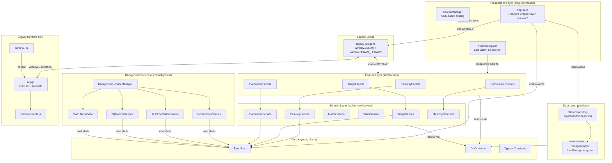
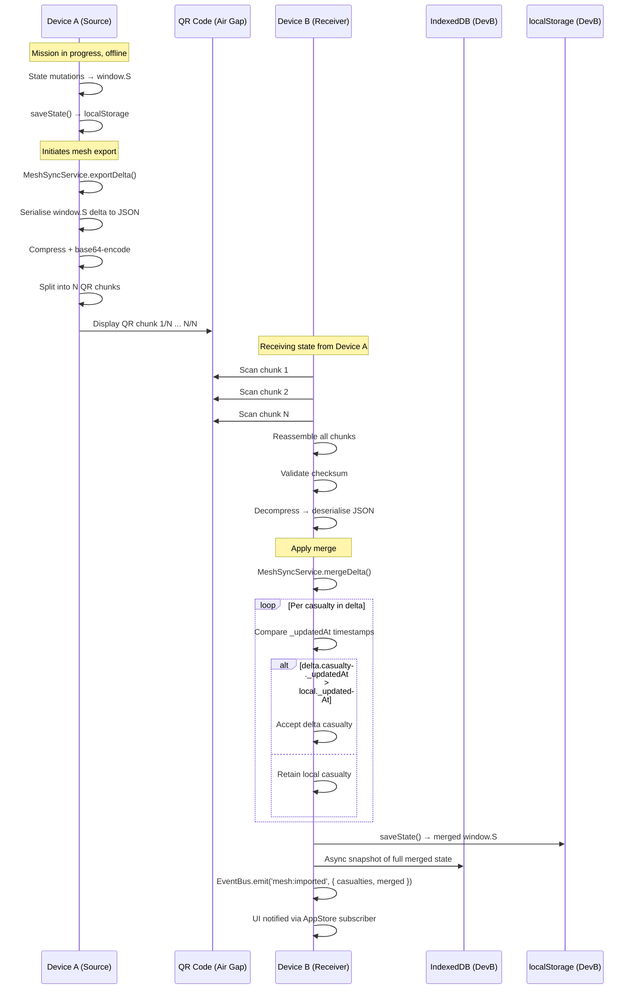

# BENAM Tactical Preview — Deep-Dive Technical Architecture

**Version:** 1.1.0  
**Classification:** Engineering Reference  
**Last Updated:** 2026-08-11

---

## 1. System Overview

BENAM is a **hybrid-architecture single-page application (SPA)** undergoing an incremental migration from a monolithic vanilla JavaScript runtime (`js/app.js` — 9 500+ LOC) to a structured TypeScript module system built on Clean Architecture principles. The two runtimes coexist and interoperate through a typed **legacy bridge** (`src/legacy-bridge.ts`), which is designed to shrink as migration progresses.

```
┌─────────────────────────────────────────────────────────┐
│                     Browser / WebView                   │
│  ┌─────────────────────────────────────────────────┐    │
│  │                   index.html                    │    │
│  │   (PWA shell, 173+ UI sections, CSP meta)       │    │
│  └────────┬─────────────────────┬──────────────────┘    │
│           │ loads               │ loads                 │
│  ┌────────▼──────┐   ┌──────────▼──────────────────┐    │ 
│  │  js/ (Legacy) │   │  src/ (TypeScript modules)  │    │
│  │  app.js       │◄──►  main.ts → legacy-bridge.ts │    │
│  │  enhancements │   │  DI Container, EventBus     │    │
│  │  parts/ (41)  │   │  Domain Services, Facades   │    │
│  └───────────────┘   └─────────────────────────────┘    │
│           │                      │                      │
│  ┌────────▼──────────────────────▼───────────────────┐  │
│  │           window.S  (legacy global state)         │  │
│  │           localStorage / IndexedDB                │  │
│  └───────────────────────────────────────────────────┘  │
└─────────────────────────────────────────────────────────┘
```

---

## 2. Directory Structure

```
BENAM---Tactical-Preview/
├── index.html                  # PWA shell; CSP meta; all UI screens as hidden divs
├── sw.js                       # Service Worker: cache-first offline strategy
├── manifest.json               # PWA manifest (icons, theme, display)
├── capacitor.config.json       # Capacitor Android bridge configuration
├── vite.config.ts              # Vite build config (TypeScript entry, output)
├── tsconfig.json               # Strict TypeScript config
├── playwright.config.js        # E2E test configuration
│
├── js/                         # Legacy runtime (Vanilla JS)
│   ├── app.js                  # Monolithic legacy application (~9 500 LOC)
│   ├── enhancements.js         # Feature additions on top of app.js
│   ├── parts/                  # Split source files (01–41) concatenated into app.js
│   │   ├── 01-state.js         # Initial state schema and persistence
│   │   ├── 02-medic-alloc.js   # Medic-to-casualty allocation logic
│   │   ├── 03-evac-engine.js   # Evacuation priority engine
│   │   ├── ...
│   │   └── 41-audio-recording.js
│   └── vendor/                 # Vendored third-party libs (Sortable, jsQR, qrcode)
│
├── src/                        # TypeScript module system (Clean Architecture)
│   ├── main.ts                 # TS entry point; bootstraps DI and all services
│   ├── main.js                 # Legacy JS entry shim (loaded before main.ts)
│   ├── legacy-bridge.ts        # Bidirectional TS ↔ window.S bridge
│   │
│   ├── core/                   # Layer 0: Framework-agnostic primitives
│   │   ├── di/                 # Dependency injection container and tokens
│   │   ├── events/             # Typed EventBus (publish/subscribe)
│   │   ├── errors/             # AppError, Result<T,E>, RetryPolicy
│   │   ├── types/              # Domain types (Casualty, Mission, Triage, etc.)
│   │   ├── utils/              # id generation, time, validation
│   │   └── constants/          # Triage values, colours, priority order
│   │
│   ├── domain/                 # Layer 1: Pure business logic
│   │   └── services/
│   │       ├── triage.service.ts       # Priority classification and sorting
│   │       ├── casualty.service.ts     # Casualty CRUD and state validation
│   │       ├── march.service.ts        # MARCH protocol step evaluation
│   │       ├── vitals.service.ts       # Vitals recording and trend analysis
│   │       ├── blood.service.ts        # Blood type compatibility logic
│   │       ├── evacuation.service.ts   # Evacuation stage transitions
│   │       ├── supply.service.ts       # Supply inventory management
│   │       ├── timeline.service.ts     # Chronological event recording
│   │       └── mesh-sync.service.ts    # QR/mesh state serialisation
│   │
│   ├── data/                   # Layer 2: Storage abstractions
│   │   ├── storage/
│   │   │   └── storage-adapter.ts      # StorageAdapter interface + LocalStorage impl
│   │   └── repositories/
│   │       └── state.repository.ts     # Typed read/write against window.S keys
│   │
│   ├── features/               # Layer 3: Use-case orchestration (Facades)
│   │   ├── casualty/           # CasualtyFacade: create, update, remove, list
│   │   ├── triage/             # TriageFacade: sort, classify, escalate
│   │   ├── evacuation/         # EvacuationFacade: stage management, report gen
│   │   └── comms-sync/         # CommsSyncFacade: QR export/import, mesh merge
│   │
│   ├── presentation/           # Layer 4: UI coordination (no DOM templates)
│   │   ├── store/
│   │   │   └── app-store.ts    # Reactive wrapper over window.S; notify on change
│   │   ├── screen/
│   │   │   └── screen-manager.ts  # Screen activation via CSS visibility
│   │   └── actions/
│   │       └── action-delegator.ts # Centralised data-action click dispatcher
│   │
│   ├── background/             # Layer 5: Background polling services
│   │   ├── background-service-manager.ts
│   │   └── services/
│   │       ├── clock.service.ts        # Mission elapsed time ticker
│   │       ├── golden-hour.service.ts  # Golden hour threshold alerts
│   │       ├── auto-escalation.service.ts  # Triage escalation watcher
│   │       ├── reassess.service.ts     # Periodic reassessment reminders
│   │       ├── tq-monitor.service.ts   # Tourniquet timer monitor
│   │       ├── heli-countdown.service.ts   # MEDEVAC ETA countdown
│   │       ├── sa-pulse.service.ts     # AI situational awareness advisor
│   │       ├── map-refresh.service.ts  # Force map state refresh
│   │       └── stats-refresh.service.ts    # Dashboard stats refresh
│   │
│   ├── components/             # JS UI component classes (hybrid layer)
│   ├── services/               # JS service classes (hybrid layer)
│   ├── constants/              # Domain-scoped constant files (JS)
│   └── utils/                  # DOM/formatting/storage helpers (JS)
│
├── tests/                      # Playwright E2E specs
│   ├── smoke.spec.js
│   ├── domain_services.spec.js
│   ├── comprehensive_tactical.spec.js
│   ├── BENAM_MASTER_UI_VALIDATION.spec.js
│   ├── BENAM_ULTIMATE_100.spec.js
│   ├── TACTICAL_SUPREME.spec.js
│   └── sync_master.spec.js
│
├── docs/                       # Engineering documentation
│   ├── PRD.md                  # Master Product Requirements Document
│   └── ARCHITECTURE.md         # This document
│
├── scripts/                    # Build-time utility scripts
│   ├── concat-parts.js         # Concatenates js/parts/* into js/app.js
│   ├── split-css.js            # Splits CSS into themed layers
│   └── export-v2.js            # Export helper v2
│
└── android/                    # Capacitor Android project
    └── app/src/main/java/com/benam/app/
        └── MainActivity.java
```

---

## 3. Dependency Injection Container

The DI container (`src/core/di/container.ts`) is a lightweight, homegrown IoC container that supports singleton and transient registrations.

```typescript
// Registration
container.registerSingleton(DI_TOKENS.EventBus, () => new EventBus());
container.registerSingleton(DI_TOKENS.TriageService, () => new TriageService());

// Resolution
const triage = container.resolve<TriageService>(DI_TOKENS.TriageService);
```

All services are resolved lazily on first request. The token registry (`src/core/di/tokens.ts`) defines a string-keyed token for each registered service, preventing stringly-typed resolution errors.

**Token categories:**

| Token Group | Examples |
|---|---|
| Infrastructure | `EventBus`, `StorageAdapter`, `StateRepository` |
| Domain Services | `TriageService`, `CasualtyService`, `MarchService`, `VitalsService` |
| Feature Facades | `CasualtyFacade`, `TriageFacade`, `EvacuationFacade`, `CommsSyncFacade` |
| Presentation | `AppStore`, `ScreenManager`, `ActionDelegator` |
| Background | `BackgroundServiceManager`, `ClockService`, `GoldenHourService` |

---

## 4. EventBus — Inter-Module Communication

The `EventBus` (`src/core/events/event-bus.ts`) implements a strongly typed publish/subscribe pattern. All cross-module side effects flow through this bus, preventing direct coupling between feature modules.

```typescript
// Emit an event
eventBus.emit('casualty:triage-changed', {
  id: casId,
  from: TriagePriority.T2,
  to: TriagePriority.T1,
});

// Subscribe (returns unsubscribe function)
const unsub = eventBus.on('casualty:triage-changed', ({ id, from, to }) => {
  console.log(`Casualty ${id} escalated from ${from} to ${to}`);
});
```

**Event categories defined in `EventMap`:**

| Category | Events |
|---|---|
| Casualty lifecycle | `casualty:added`, `casualty:updated`, `casualty:removed`, `casualty:triage-changed`, `casualty:escalated` |
| Treatment | `treatment:applied`, `treatment:tq-started`, `treatment:vitals-recorded` |
| Mission | `mission:started`, `mission:ended`, `mission:mode-changed` |
| Sync | `mesh:exported`, `mesh:imported`, `qr:scan-complete` |
| Supply | `supply:used`, `supply:low` |
| UI / Navigation | `screen:changed`, `drawer:opened`, `drawer:closed` |
| Alerts | `alert:ai-advisor`, `alert:golden-hour`, `alert:golden-hour-half` |

---

## 5. State Management

### 5.1 AppStore

`AppStore` (`src/presentation/store/app-store.ts`) is a **reactive wrapper** over `window.S` — the legacy global state object. It does **not** own state; `window.S` remains the source of truth during the migration.

```
AppStore.dispatch(updater)
    │
    ├─► updater(currentState) → patch
    ├─► apply patch to window.S
    ├─► call window.saveState() [legacy persistence]
    ├─► snapshot current JSON for change detection
    └─► notify all subscribers via StateListener callbacks
         └─► EventBus.emit('state:saved', { timestamp })
```

The `syncFromLegacy()` method polls `window.S` for external mutations from legacy code and notifies subscribers when divergence is detected, creating a one-way reactive bridge from the legacy runtime to the TS layer.

### 5.2 State Schema (Legacy `window.S`)

```typescript
interface LegacyState {
  mode: string;              // 'operational' | 'training'
  role: string;              // 'commander' | 'medic' | 'doc' | 'paramedic'
  missionStarted: boolean;
  missionTime: number;       // Unix timestamp of mission start
  casualties: Casualty[];
  force: ForceMember[];
  timeline: TimelineEntry[];
  supplies: SupplyMap;
  comms: CommsLog;
  meshReceived: MeshDelta[];
  _meshLastSync: number;     // Timestamp of last mesh sync
  _meshPendingDeltas: Delta[];
  [key: string]: unknown;    // Open for legacy extension
}
```

---

## 6. Data Flow Diagrams

### 6.1 Component Architecture Diagram



### 6.2 Offline-to-Online Sync Sequence Diagram



---

## 7. ActionDelegator — Centralised Event Delegation

The `ActionDelegator` (`src/presentation/actions/action-delegator.ts`) replaces inline `onclick` attributes with a single `document`-level click listener.

**Pattern:**

```html
<!-- Before (legacy, requires 'unsafe-inline' in CSP) -->
<button onclick="startMission()">Start</button>

<!-- After (ActionDelegator compatible, CSP-safe) -->
<button data-action="startMission">Start</button>
```

**Registration:**

```typescript
delegator.register('startMission', async (event, element) => {
  await missionFacade.start();
});

// Or bulk-register
delegator.registerMany({
  'selectRole': (e, el) => { appStore.dispatch(s => ({ ...s, role: el.dataset.role })); },
  'openCasualtyDrawer': (e, el) => { casualtyFacade.openDrawer(el.dataset.id); },
});
```

**Click handling flow:**

```
document.addEventListener('click', handler, true)  ← capture phase
    │
    ├─► Walk DOM upward from event.target
    ├─► Find closest element with data-action attribute
    ├─► Lookup handler in Map<string, ActionHandler>
    ├─► Execute handler(event, element)
    └─► If no handler found: no-op (event propagates normally)
```

**Migration status**: 173 inline `onclick` handlers remain in `index.html`. Migration to `data-action` is planned for Phase 8.

---

## 8. Background Services Architecture

All background services extend `BackgroundService` and are managed by `BackgroundServiceManager`.

```typescript
abstract class BackgroundService {
  abstract get name(): string;
  abstract start(context: ServiceContext): void;
  abstract stop(): void;
}
```

**Lifecycle:**
- All services are registered on app boot via `registerBackgroundServices(container)`.
- `BackgroundServiceManager.startAll()` is called after the mission starts.
- `BackgroundServiceManager.stopAll()` is called on mission end or app teardown.
- Each service receives an injected `ServiceContext` containing `eventBus`, `appStore`, and `container`.

**Polling intervals:**

| Service | Interval | Trigger |
|---|---|---|
| ClockService | 1 000 ms | Continuous; emits mission elapsed time |
| GoldenHourService | 30 000 ms | Checks all T1 casualties for 55-min threshold |
| AutoEscalationService | 60 000 ms | Evaluates vitals trend against escalation rules |
| TQMonitorService | 60 000 ms | Checks tourniquet application times |
| SAPulseService | 120 000 ms | Runs AI advisor evaluation |
| ReassessService | 300 000 ms | Emits reassessment reminders |
| StatsRefreshService | 5 000 ms | Refreshes dashboard statistics |
| MapRefreshService | 10 000 ms | Refreshes force map overlay |

---

## 9. Error Handling Strategy

The domain and data layers use a **Result monad** pattern (`src/core/errors/result.ts`):

```typescript
type Result<T, E extends AppError = AppError> = Ok<T> | Err<E>;

// Usage in storage adapter
get<T>(key: string): Result<T | null> {
  try {
    const raw = localStorage.getItem(this.prefix + key);
    return Ok(raw === null ? null : JSON.parse(raw) as T);
  } catch (e) {
    return Err(new AppError(ErrorCode.STORAGE_READ_FAILURE, String(e), ErrorSeverity.High));
  }
}
```

`AppError` carries:
- `code: ErrorCode` — machine-readable error category
- `message: string` — human-readable description
- `severity: ErrorSeverity` — Low / Medium / High / Critical
- `cause?: unknown` — original exception for stack traces

`RetryPolicy` (`src/core/errors/retry-policy.ts`) implements exponential backoff for async storage and sync operations.

---

## 10. Security Architecture

### 10.1 PIN Authentication Flow

```
User enters PIN
    │
    ▼
PinSecurityService.hashPin(pin, salt)
    │ SHA-256 via crypto.subtle.digest (WebCrypto API)
    ▼
hash (60-char bcrypt string)
    │
    ├── Compare with stored benam_pin_hash
    │       │
    │       ├── Match → grant session, set session token
    │       └── No match → increment fail counter, lock after 5 failures
    │
    └── New PIN setup: crypto.getRandomValues(16 bytes) → salt
                       hash(pin + salt) → store hash + salt
```

### 10.2 Content Security Policy

Current policy (from `index.html`):

```
default-src 'self';
script-src  'self' 'unsafe-inline';   ← temporary; removal in Phase 8
style-src   'self' 'unsafe-inline';
img-src     'self' data: blob:;
connect-src 'self';
font-src    'self';
media-src   'self' blob:;
```

`'unsafe-eval'` is **explicitly absent** — no dynamic code evaluation is permitted. `'unsafe-inline'` is pending removal upon completion of the ActionDelegator migration.

---

## 11. Build and Toolchain

| Tool | Role |
|---|---|
| **Vite 8** | Module bundler; TypeScript transpilation; dev server |
| **TypeScript 5.9** | Strict mode (`"strict": true`); no implicit any |
| **Playwright 1.58** | E2E browser testing against Chromium |
| **Capacitor 8** | Android WebView packaging |
| **Gradle** | Android APK compilation |

**Build outputs:**

```
dist/
├── index.html         # Processed HTML with asset hashes
├── assets/
│   ├── main.*.js      # TypeScript bundle (Vite output)
│   └── *.css          # Bundled stylesheets
js/                    # Legacy runtime (not bundled by Vite; loaded via <script>)
sw.js                  # Service Worker (copied verbatim to dist)
```

---

## 12. Testing Strategy

| Level | Tool | Coverage Target |
|---|---|---|
| Type safety | `tsc --noEmit` | 100% of `src/` |
| Domain unit | Playwright `domain_services.spec.js` | Core service behaviours |
| Integration / E2E | Playwright `.spec.js` suite | All major user flows |
| Regression | `BENAM_MASTER_UI_VALIDATION.spec.js` | UI surface validation |
| Smoke | `smoke.spec.js` | Boot and navigation |

Playwright is configured in `playwright.config.js` with:
- `bypassCSP: true` — tests run without CSP blocking (mirrors field browser configuration)
- `locale: 'he-IL'` — RTL Hebrew locale for all test runs
- `workers: 1` — serial execution (state-sharing single-page tests)
- `webServer` — Vite dev server started automatically per test run
